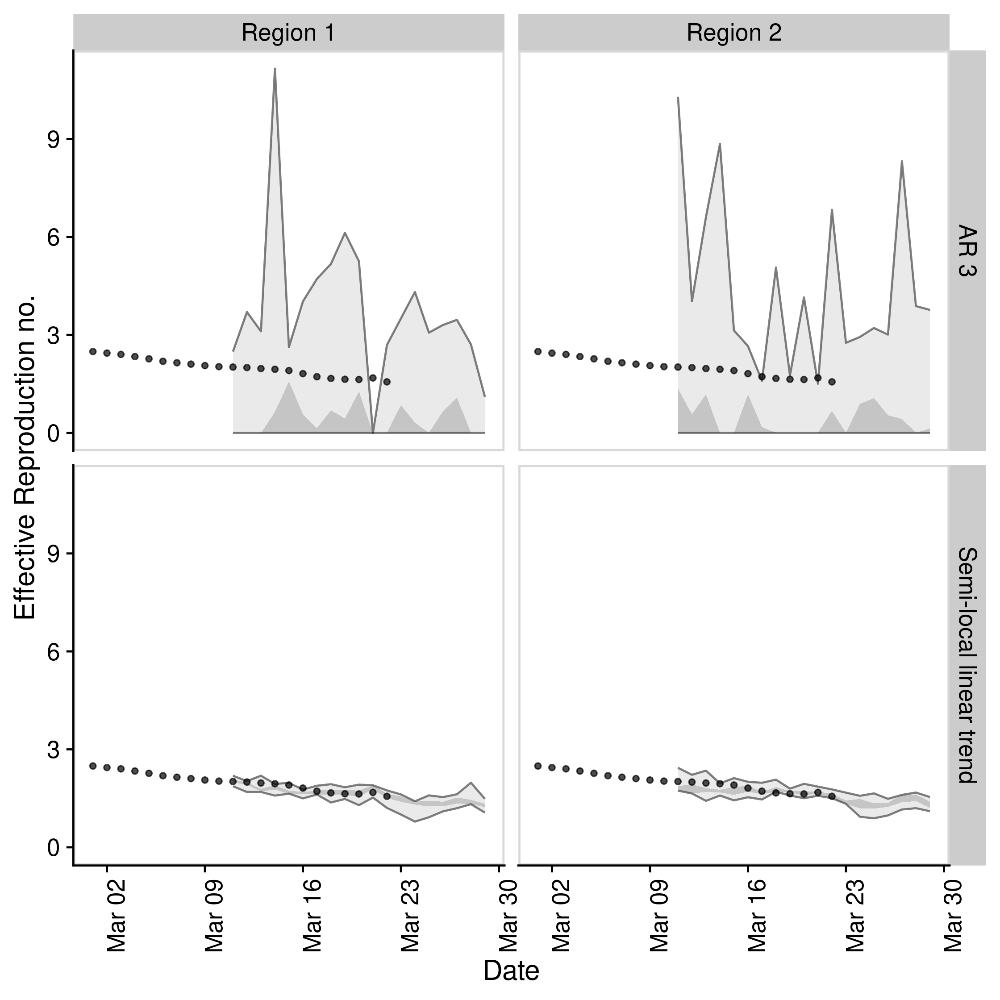

# EpiSoon

[](https://github.com/epiforecasts/EpiSoon)
[](https://hub.docker.com/repository/docker/seabbs/episoon)
[](https://zenodo.org/badge/latestdoi/248311916)

This package provides tooling to forecast the time-varying reproduction
number and use this to forecast reported case counts via a branching
process. It supports a range of time series modelling packages including
`bsts`, `forecast`, and `fable`. It also supports ensembles via `stackr`
and `forecastHyrbid`. Forecasts can be assessed by iteractively fitting
and then using proper scoring rules (via `scoringutils` and
`scoringRules`) to compare to both observed case counts and estimated
reproduction numbers. Whilst `EpiSoon` is primarily developed to be used
in tandem with `EpiNow` it can also be used as a standalone package.

## Installation

Install the stable version of the package using
[`{drat}`](https://epiforecasts.io/drat/):

``` r
install.packages("drat")
drat:::add("epiforecasts")
install.packages("EpiSoon")
```

Install the development version of the package with:

``` r
remotes::install_github("epiforecasts/EpiSoon")
```

## Quick start

  - Load packages (`bsts` and `fable` for models, `ggplot2` for
    plotting, and `cowplot` for theming)

<!-- end list -->

``` r
library(EpiSoon)
library(bsts)
library(fable)
#> Warning in system("timedatectl", intern = TRUE): running command 'timedatectl'
#> had status 1
library(future)
library(cowplot)
library(dplyr)
```

  - Set up example data (using `EpiSoon::example_obs_rts` and
    `EpiSoon::example_obs_cases` as starting data sets). When generating
    timeseries with `EpiNow` use `get_timeseries` to extract the
    required data.

<!-- end list -->

``` r
obs_rts <- EpiSoon::example_obs_rts %>%
   dplyr::mutate(timeseries = "Region 1") %>%
   dplyr::bind_rows(EpiSoon::example_obs_rts %>%
  dplyr::mutate(timeseries = "Region 2"))

obs_cases <- EpiSoon::example_obs_cases %>%
   dplyr::mutate(timeseries = "Region 1") %>%
   dplyr::bind_rows(EpiSoon::example_obs_cases %>%
   dplyr::mutate(timeseries = "Region 2"))
```

  - Define the list of models to be compared.

<!-- end list -->

``` r
models <- list("AR 3" =
                function(...) {EpiSoon::bsts_model(model =
                     function(ss, y){bsts::AddAr(ss, y = y, lags = 3)}, ...)},
               "Semi-local linear trend" =
                function(...) {EpiSoon::bsts_model(model =
                    function(ss, y){bsts::AddSemilocalLinearTrend(ss, y = y)}, ...)},
               "ARIMA" = 
                    function(...){EpiSoon::fable_model(model = fable::ARIMA(y ~ time), ...)})
```

  - Compare models across timeseries (change the `future::plan` to do
    this in parallel).

<!-- end list -->

``` r
future::plan("sequential")

## Compare models
forecasts <- EpiSoon::compare_timeseries(obs_rts, obs_cases, models,
                                         horizon = 7, samples = 10,
                                         serial_interval = EpiSoon::example_serial_interval)
#> Warning: Unknown or uninitialised column: `sample`.

#> Warning: Unknown or uninitialised column: `sample`.

forecasts
#> $forecast_rts
#> # A tibble: 532 x 12
#>    timeseries model forecast_date date       horizon median   mean    sd bottom
#>    <chr>      <chr> <chr>         <date>       <int>  <dbl>  <dbl> <dbl>  <dbl>
#>  1 Region 1   AR 3  2020-03-04    2020-03-05       1  1.24  2.35   3.49       0
#>  2 Region 1   AR 3  2020-03-04    2020-03-06       2  1.75  2.09   2.77       0
#>  3 Region 1   AR 3  2020-03-04    2020-03-07       3  0     1.96   4.07       0
#>  4 Region 1   AR 3  2020-03-04    2020-03-08       4  0     1.30   2.49       0
#>  5 Region 1   AR 3  2020-03-04    2020-03-09       5  0     0.564  1.07       0
#>  6 Region 1   AR 3  2020-03-04    2020-03-10       6  0.832 1.60   2.23       0
#>  7 Region 1   AR 3  2020-03-04    2020-03-11       7  1.45  1.49   1.45       0
#>  8 Region 1   AR 3  2020-03-05    2020-03-06       1  0     0.0907 0.287      0
#>  9 Region 1   AR 3  2020-03-05    2020-03-07       2  0     0.591  0.970      0
#> 10 Region 1   AR 3  2020-03-05    2020-03-08       3  0     0.710  1.66       0
#> # … with 522 more rows, and 3 more variables: lower <dbl>, upper <dbl>,
#> #   top <dbl>
#> 
#> $rt_scores
#> # A tibble: 420 x 14
#>    timeseries model forecast_date date       horizon    dss  crps   logs   bias
#>    <chr>      <chr> <chr>         <date>       <int>  <dbl> <dbl>  <dbl>  <dbl>
#>  1 Region 1   AR 3  2020-03-04    2020-03-05       1  2.39  0.766   1.98 -0.200
#>  2 Region 1   AR 3  2020-03-04    2020-03-06       2  1.93  0.509   1.64 -0.200
#>  3 Region 1   AR 3  2020-03-04    2020-03-07       3  2.70  1.37    6.40 -0.6  
#>  4 Region 1   AR 3  2020-03-04    2020-03-08       4  1.83  1.26    4.87 -0.6  
#>  5 Region 1   AR 3  2020-03-04    2020-03-09       5  2.19  1.30    3.78 -0.8  
#>  6 Region 1   AR 3  2020-03-04    2020-03-10       6  1.54  0.719   1.93 -0.6  
#>  7 Region 1   AR 3  2020-03-04    2020-03-11       7  0.780 0.463   1.52 -0.400
#>  8 Region 1   AR 3  2020-03-05    2020-03-06       1 57.0   2.02  Inf    -1    
#>  9 Region 1   AR 3  2020-03-05    2020-03-07       2  2.69  1.20    1.74 -0.6  
#> 10 Region 1   AR 3  2020-03-05    2020-03-08       3  1.69  1.42   16.0  -0.8  
#> # … with 410 more rows, and 5 more variables: sharpness <dbl>,
#> #   calibration <dbl>, median <dbl>, iqr <dbl>, ci <dbl>
#> 
#> $forecast_cases
#> # A tibble: 420 x 12
#>    timeseries model forecast_date date       horizon median  mean    sd bottom
#>    <chr>      <chr> <chr>         <date>       <int>  <dbl> <dbl> <dbl>  <dbl>
#>  1 Region 1   AR 3  2020-03-04    2020-03-05       1   37.5  70.3 104.       0
#>  2 Region 1   AR 3  2020-03-04    2020-03-06       2   61    77.7  98.1      0
#>  3 Region 1   AR 3  2020-03-04    2020-03-07       3    0   168.  421.       0
#>  4 Region 1   AR 3  2020-03-04    2020-03-08       4    0    89.4 228.       0
#>  5 Region 1   AR 3  2020-03-04    2020-03-09       5    0    17.9  35.7      0
#>  6 Region 1   AR 3  2020-03-04    2020-03-10       6   27   248   609.       0
#>  7 Region 1   AR 3  2020-03-04    2020-03-11       7   39   136.  177.       0
#>  8 Region 1   AR 3  2020-03-05    2020-03-06       1    0     4    12.6      0
#>  9 Region 1   AR 3  2020-03-05    2020-03-07       2    0    24.2  40.0      0
#> 10 Region 1   AR 3  2020-03-05    2020-03-08       3    0    26.7  69.1      0
#> # … with 410 more rows, and 3 more variables: lower <dbl>, upper <dbl>,
#> #   top <dbl>
#> 
#> $case_scores
#> # A tibble: 420 x 15
#>    timeseries model sample forecast_date date       horizon   dss  crps   logs
#>    <chr>      <chr> <chr>  <chr>         <date>       <int> <dbl> <dbl>  <dbl>
#>  1 Region 1   AR 3  1      2020-03-04    2020-03-05       1  9.18  21.9   5.34
#>  2 Region 1   AR 3  1      2020-03-04    2020-03-06       2  9.07  19.5   5.32
#>  3 Region 1   AR 3  1      2020-03-04    2020-03-07       3 12.0   68.1  18.2 
#>  4 Region 1   AR 3  1      2020-03-04    2020-03-08       4 10.8   64.1   6.21
#>  5 Region 1   AR 3  1      2020-03-04    2020-03-09       5 15.4   83.8   5.81
#>  6 Region 1   AR 3  1      2020-03-04    2020-03-10       6 12.8   88.7   7.54
#>  7 Region 1   AR 3  1      2020-03-04    2020-03-11       7 10.3   79.0   6.58
#>  8 Region 1   AR 3  1      2020-03-05    2020-03-06       1 38.0   65.4 Inf   
#>  9 Region 1   AR 3  1      2020-03-05    2020-03-07       2 10.1   49.8   5.56
#> 10 Region 1   AR 3  1      2020-03-05    2020-03-08       3  9.69  76.0 284.  
#> # … with 410 more rows, and 6 more variables: bias <dbl>, sharpness <dbl>,
#> #   calibration <dbl>, median <dbl>, iqr <dbl>, ci <dbl>
```

  - Plot an evaluation of Rt forecasts using iterative
fitting.

<!-- end list -->

``` r
EpiSoon::plot_forecast_evaluation(forecasts$forecast_rts, obs_rts, c(7)) +
   ggplot2::facet_grid(model ~ timeseries) +
   cowplot::panel_border()
```



  - Plot an evaluation of case forecasts using iterative
fitting

<!-- end list -->

``` r
EpiSoon::plot_forecast_evaluation(forecasts$forecast_cases, obs_cases, c(7)) +
   ggplot2::facet_grid(model ~ timeseries, scales = "free") +
   cowplot::panel_border()
```


  - Summarise the forecasts by model scored against observed cases

<!-- end list -->

``` r
EpiSoon::summarise_scores(forecasts$case_scores)
#> # A tibble: 18 x 9
#>    score  model   bottom    lower   median      mean    upper      top        sd
#>    <chr>  <chr>    <dbl>    <dbl>    <dbl>     <dbl>    <dbl>    <dbl>     <dbl>
#>  1 bias   AR 3  -1.00e+0 -8.00e-1 -8.00e-1   -0.69   -6.00e-1   -0.200    0.249 
#>  2 bias   Semi… -1.00e+0  2.00e-1  6.00e-1    0.492   1.00e+0    1        0.554 
#>  3 calib… AR 3   8.57e-5  8.57e-5  8.57e-5    0.0215  1.33e-3    0.181    0.0814
#>  4 calib… Semi…  8.57e-5  8.57e-5  8.57e-5    0.0615  5.52e-4    0.834    0.164 
#>  5 ci     AR 3   1.34e+2  3.60e+2  6.31e+2 1421.      1.32e+3 7967.    2035.    
#>  6 ci     Semi…  2.61e+1  4.98e+1  1.09e+2  947.      1.41e+3 5420.    1592.    
#>  7 crps   AR 3   3.53e+1  8.94e+1  1.35e+2  152.      1.96e+2  362.      87.3   
#>  8 crps   Semi…  3.44e+0  6.66e+0  1.53e+1   40.8     7.01e+1  161.      48.8   
#>  9 dss    AR 3   9.13e+0  1.09e+1  1.19e+1   16.2     1.35e+1   53.9     20.1   
#> 10 dss    Semi…  4.72e+0  6.13e+0  7.80e+0   13.2     1.40e+1   50.3     16.5   
#> 11 iqr    AR 3   1.25e+2  3.57e+2  5.72e+2  677.      9.11e+2 1776.     440.    
#> 12 iqr    Semi…  1.36e+1  2.92e+1  6.80e+1  178.      3.09e+2  675.     208.    
#> 13 logs   AR 3   5.61e+0  6.64e+0  7.33e+0  Inf       1.17e+1  Inf      Inf     
#> 14 logs   Semi…  3.37e+0  4.09e+0  4.80e+0  Inf       7.29e+0   47.6    Inf     
#> 15 median AR 3   1.15e+2  2.66e+2  4.36e+2  472.      5.92e+2 1119.     262.    
#> 16 median Semi…  2.00e+0  1.60e+1  4.75e+1  100.      1.70e+2  340.     112.    
#> 17 sharp… AR 3   0.       0.       1.11e+1   58.5     7.01e+1  386.      99.6   
#> 18 sharp… Semi…  6.67e+0  1.35e+1  2.15e+1   26.7     3.41e+1   76.8     18.7
```

## Contributing

File an issue [here](https://github.com/epiforecasts/EpiSoon/issues) if
you have identified an issue with the package. Please note that due to
operational constraints priority will be given to users informing
government policy or offering methodological insights. We welcome all
contributions, in particular those that improve the approach or the
robustness of the code base.

## Docker

This package was developed in a docker container based on the
`rocker/geospatial` docker image.

To build the docker image run (from the `EpiSoon` directory):

``` bash
docker build . -t episoon
```

To run the docker image
run:

``` bash
docker run -d -p 8787:8787 --name episoon -e USER=episoon -e PASSWORD=episoon episoon
```

The rstudio client can be found on port :8787 at your local machines ip.
The default username:password is epinow:epinow, set the user with -e
USER=username, and the password with - e PASSWORD=newpasswordhere. The
default is to save the analysis files into the user directory.

To mount a folder (from your current working directory - here assumed to
be `tmp`) in the docker container to your local system use the following
in the above docker run command (as given mounts the whole `episoon`
directory to `tmp`).

``` bash
--mount type=bind,source=$(pwd)/tmp,target=/home/EpiSoon
```

To access the command line run the following:

``` bash
docker exec -ti episoon bash
```
