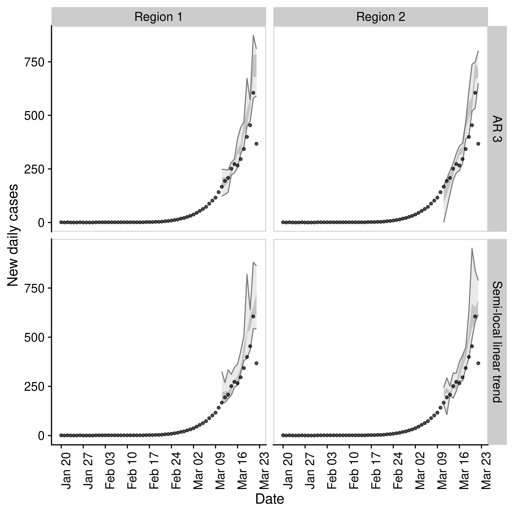

# EpiSoon

[](https://lifecycle.r-lib.org/articles/stages.html#experimental)
[](https://github.com/epiforecasts/EpiSoon)
[](https://app.codecov.io/gh/epiforecasts/EpiSoon?branch=main)
[](https://github.com/epiforecasts/EpiSoon/blob/main/LICENSE.md/)
[](https://github.com/epiforecasts/EpiSoon/graphs/contributors)
[](http://epiforecasts.r-universe.dev/ui/#package:EpiSoon)
[](https://zenodo.org/badge/latestdoi/248311916)

This package provides tooling to forecast the time-varying reproduction
number and use this to forecast reported case counts via a branching
process. It supports a range of time series modelling packages including
`bsts`, `forecast`, and `fable`. It also supports ensembles via `stackr`
and `forecastHyrbid`. Forecasts can be assessed by iteractively fitting
and then using proper scoring rules (via `scoringutils` and
`scoringRules`) to compare to both observed case counts and estimated
reproduction numbers.

## Installation

Install the stable development version of the package with:

``` r
install.packages("EpiSoon", repos = "https://epiforecasts.r-universe.dev")
```

Install the unstable development version of the package with (few users
should need to do this):

``` r
remotes::install_github("epiforecasts/EpiSoon")
```

## Quick start

  - Load packages (`bsts` and `fable` for models, `ggplot2` for
    plotting, and `cowplot` for theming)

<!-- end list -->

``` r
library(EpiSoon)
library(bsts)
library(fable)
library(future)
library(cowplot)
library(dplyr)
```

  - Set up example data (using `EpiSoon::example_obs_rts` and
    `EpiSoon::example_obs_cases` as starting data sets). When generating
    timeseries with `EpiNow` use `get_timeseries` to extract the
    required data.

<!-- end list -->

``` r
obs_rts <- EpiSoon::example_obs_rts %>%
  dplyr::mutate(timeseries = "Region 1") %>%
  dplyr::bind_rows(EpiSoon::example_obs_rts %>%
    dplyr::mutate(timeseries = "Region 2"))

obs_cases <- EpiSoon::example_obs_cases %>%
  dplyr::mutate(timeseries = "Region 1") %>%
  dplyr::bind_rows(EpiSoon::example_obs_cases %>%
    dplyr::mutate(timeseries = "Region 2"))
```

  - Define the list of models to be compared.

<!-- end list -->

``` r
models <- list(
  "AR 3" =
    function(...) {
      EpiSoon::bsts_model(
        model =
          function(ss, y) {
            bsts::AddAr(ss, y = y, lags = 3)
          }, ...
      )
    },
  "Semi-local linear trend" =
    function(...) {
      EpiSoon::bsts_model(
        model =
          function(ss, y) {
            bsts::AddSemilocalLinearTrend(ss, y = y)
          }, ...
      )
    },
  "ARIMA" =
    function(...) {
      EpiSoon::fable_model(model = fable::ARIMA(y ~ time), ...)
    }
)
```

  - Compare models across timeseries (change the `future::plan` to do
    this in parallel).

<!-- end list -->

``` r
future::plan("sequential")

## Compare models
forecasts <- EpiSoon::compare_timeseries(obs_rts, obs_cases, models,
  horizon = 7, samples = 10,
  serial_interval = EpiSoon::example_serial_interval
)
#> Warning: There were 40 warnings in `dplyr::mutate()`.
#> The first warning was:
#> ℹ In argument: `eval = furrr::future_pmap(...)`.
#> Caused by warning:
#> ! Unknown or uninitialised column: `.distribution`.
#> ℹ Run `dplyr::last_dplyr_warnings()` to see the 39 remaining warnings.

forecasts
#> $forecast_rts
#> # A tibble: 511 × 12
#>    timeseries model foreca…¹ date       horizon median  mean     sd bottom lower
#>    <chr>      <chr> <chr>    <date>       <int>  <dbl> <dbl>  <dbl>  <dbl> <dbl>
#>  1 Region 1   AR 3  2020-03… 2020-03-05       1   2.26  2.25 0.0504   2.17  2.25
#>  2 Region 1   AR 3  2020-03… 2020-03-06       2   2.21  2.19 0.0729   2.09  2.19
#>  3 Region 1   AR 3  2020-03… 2020-03-07       3   2.15  2.12 0.0957   1.95  2.13
#>  4 Region 1   AR 3  2020-03… 2020-03-08       4   2.07  2.05 0.128    1.86  2.06
#>  5 Region 1   AR 3  2020-03… 2020-03-09       5   2.00  1.98 0.165    1.69  2.00
#>  6 Region 1   AR 3  2020-03… 2020-03-10       6   1.95  1.93 0.173    1.61  1.93
#>  7 Region 1   AR 3  2020-03… 2020-03-11       7   1.90  1.86 0.199    1.52  1.86
#>  8 Region 1   AR 3  2020-03… 2020-03-07       1   2.11  2.11 0.0389   2.02  2.10
#>  9 Region 1   AR 3  2020-03… 2020-03-08       2   2.04  2.03 0.0449   1.94  2.02
#> 10 Region 1   AR 3  2020-03… 2020-03-09       3   1.97  1.94 0.0713   1.80  1.96
#> # … with 501 more rows, 2 more variables: upper <dbl>, top <dbl>, and
#> #   abbreviated variable name ¹​forecast_date
#> 
#> $rt_scores
#> # A tibble: 399 × 12
#>    timeseries model forec…¹ date       horizon    mad  bias   dss   crps log_s…²
#>    <chr>      <chr> <chr>   <date>       <int>  <dbl> <dbl> <dbl>  <dbl>   <dbl>
#>  1 Region 1   AR 3  2020-0… 2020-03-05       1 0.0514  -0.2 -5.98 0.0110  -1.96 
#>  2 Region 1   AR 3  2020-0… 2020-03-06       2 0.0630   0.4 -5.34 0.0176  -1.55 
#>  3 Region 1   AR 3  2020-0… 2020-03-07       3 0.0879   0   -4.72 0.0232  -1.31 
#>  4 Region 1   AR 3  2020-0… 2020-03-08       4 0.129   -0.2 -4.01 0.0345  -0.961
#>  5 Region 1   AR 3  2020-0… 2020-03-09       5 0.165   -0.4 -3.44 0.0514  -0.764
#>  6 Region 1   AR 3  2020-0… 2020-03-10       6 0.170   -0.4 -3.25 0.0578  -0.713
#>  7 Region 1   AR 3  2020-0… 2020-03-11       7 0.186   -0.6 -2.67 0.0902  -0.483
#>  8 Region 1   AR 3  2020-0… 2020-03-07       1 0.0283  -0.8 -5.53 0.0207  -2.05 
#>  9 Region 1   AR 3  2020-0… 2020-03-08       2 0.0273  -1   -3.32 0.0506  -0.712
#> 10 Region 1   AR 3  2020-0… 2020-03-09       3 0.0398  -1   -2.13 0.0864  -0.162
#> # … with 389 more rows, 2 more variables: ae_median <dbl>, se_mean <dbl>, and
#> #   abbreviated variable names ¹​forecast_date, ²​log_score
#> 
#> $forecast_cases
#> # A tibble: 399 × 12
#>    timeseries model forecas…¹ date       horizon median  mean    sd bottom lower
#>    <chr>      <chr> <chr>     <date>       <int>  <dbl> <dbl> <dbl>  <dbl> <dbl>
#>  1 Region 1   AR 3  2020-03-… 2020-03-05       1   68.5  67.5  5.91     59    61
#>  2 Region 1   AR 3  2020-03-… 2020-03-06       2   81.5  80.5 11.8      61    72
#>  3 Region 1   AR 3  2020-03-… 2020-03-07       3   97    94.4 15.7      68    94
#>  4 Region 1   AR 3  2020-03-… 2020-03-08       4  114   116.  13.9     102   102
#>  5 Region 1   AR 3  2020-03-… 2020-03-09       5  139   131.  24.0      98   132
#>  6 Region 1   AR 3  2020-03-… 2020-03-10       6  150.  156.  23.9     117   141
#>  7 Region 1   AR 3  2020-03-… 2020-03-11       7  186.  182.  41.1     122   155
#>  8 Region 1   AR 3  2020-03-… 2020-03-07       1   94.5  92.7  8.30     80    94
#>  9 Region 1   AR 3  2020-03-… 2020-03-08       2  108   107.   6.34     95   104
#> 10 Region 1   AR 3  2020-03-… 2020-03-09       3  122.  121.  13.8      94   115
#> # … with 389 more rows, 2 more variables: upper <dbl>, top <dbl>, and
#> #   abbreviated variable name ¹​forecast_date
#> 
#> $case_scores
#> # A tibble: 399 × 12
#>    timeseries model sample forecast…¹ date       horizon   mad  bias   dss  crps
#>    <chr>      <chr> <chr>  <chr>      <date>       <int> <dbl> <dbl> <dbl> <dbl>
#>  1 Region 1   AR 3  1      2020-03-04 2020-03-05       1  6.67   0.4  4.09  2.75
#>  2 Region 1   AR 3  1      2020-03-04 2020-03-06       2 11.1    0.4  5.28  4.77
#>  3 Region 1   AR 3  1      2020-03-04 2020-03-07       3 13.3    0.4  5.58  6.3 
#>  4 Region 1   AR 3  1      2020-03-04 2020-03-08       4 14.1    0.6  6.30  6.85
#>  5 Region 1   AR 3  1      2020-03-04 2020-03-09       5 29.7    0.2  6.70 11.1 
#>  6 Region 1   AR 3  1      2020-03-04 2020-03-10       6 14.1    0.6  6.68  7.7 
#>  7 Region 1   AR 3  1      2020-03-04 2020-03-11       7 42.3    0.2  7.47 13.1 
#>  8 Region 1   AR 3  1      2020-03-06 2020-03-07       1  8.90   0.4  4.48  3.65
#>  9 Region 1   AR 3  1      2020-03-06 2020-03-08       2  5.19   0.6  4.23  3.68
#> 10 Region 1   AR 3  1      2020-03-06 2020-03-09       3 13.3    0.2  5.26  4.1 
#> # … with 389 more rows, 2 more variables: ae_median <dbl>, se_mean <dbl>, and
#> #   abbreviated variable name ¹​forecast_date
```

  - Plot an evaluation of Rt forecasts using iterative fitting.

<!-- end list -->

``` r
EpiSoon::plot_forecast_evaluation(forecasts$forecast_rts, obs_rts, c(7)) +
  ggplot2::facet_grid(model ~ timeseries) +
  cowplot::panel_border()
```


  - Plot an evaluation of case forecasts using iterative fitting

<!-- end list -->

``` r
EpiSoon::plot_forecast_evaluation(forecasts$forecast_cases, obs_cases, c(7)) +
  ggplot2::facet_grid(model ~ timeseries, scales = "free") +
  cowplot::panel_border()
```



  - Summarise the forecasts by model scored against observed cases

<!-- end list -->

``` r
EpiSoon::summarise_scores(forecasts$case_scores)
#> # A tibble: 12 × 9
#>    score     model             bottom lower median    mean  upper    top      sd
#>    <chr>     <chr>              <dbl> <dbl>  <dbl>   <dbl>  <dbl>  <dbl>   <dbl>
#>  1 ae_median AR 3               0.85   9     24.5  5.69e+1   91   2.27e2 6.28e+1
#>  2 ae_median Semi-local linea…  0.613  8.5   24.2  5.11e+1   92.4 1.88e2 5.86e+1
#>  3 bias      AR 3              -1      0      0.6  4.47e-1    1   1   e0 6.13e-1
#>  4 bias      Semi-local linea… -1      0.2    0.6  4.81e-1    1   1   e0 5.90e-1
#>  5 crps      AR 3               2.94   6.57  17.8  4.69e+1   79.3 2.00e2 5.59e+1
#>  6 crps      Semi-local linea…  2.80   6.82  15.6  4.18e+1   69.5 1.60e2 5.12e+1
#>  7 dss       AR 3               4.53   6.09   8.33 1.29e+1   15.9 4.67e1 1.09e+1
#>  8 dss       Semi-local linea…  4.56   6.20   7.74 1.28e+1   12.7 5.07e1 1.35e+1
#>  9 mad       AR 3               7.93  13.3   21.5  2.61e+1   34.1 8.51e1 1.76e+1
#> 10 mad       Semi-local linea…  6.10  12.8   19.3  2.46e+1   31.1 6.58e1 1.70e+1
#> 11 se_mean   AR 3               1.15  81    784    7.29e+3 8855.  4.72e4 1.56e+4
#> 12 se_mean   Semi-local linea…  0.524 79.2  595.   6.26e+3 8663.  4.16e4 1.31e+4
```

## Contributing

File an issue [here](https://github.com/epiforecasts/EpiSoon/issues) if
you have identified an issue with the package. Please note that due to
operational constraints priority will be given to users informing
government policy or offering methodological insights. We welcome all
contributions, in particular those that improve the approach or the
robustness of the code base.
