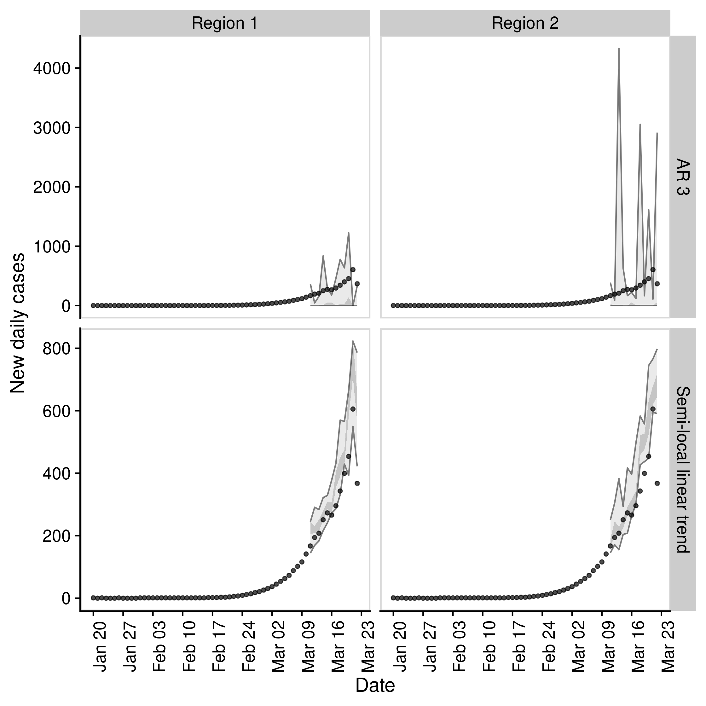
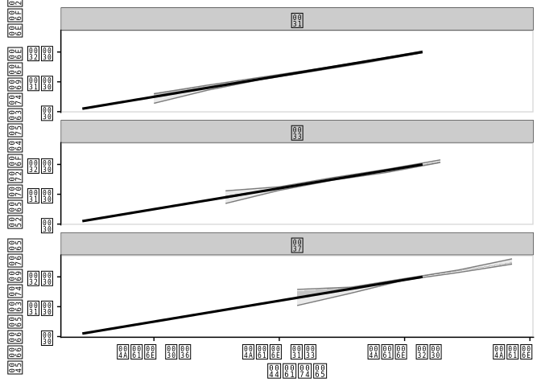
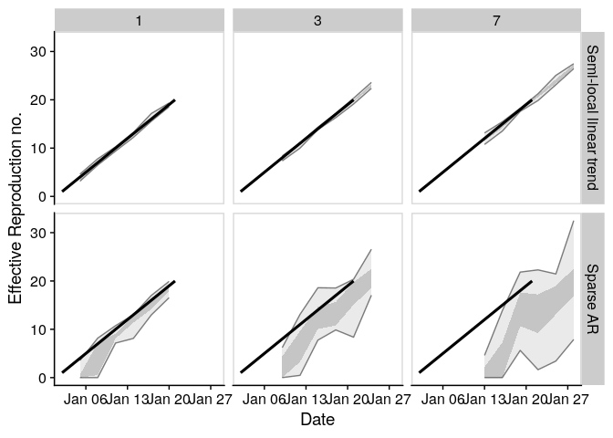
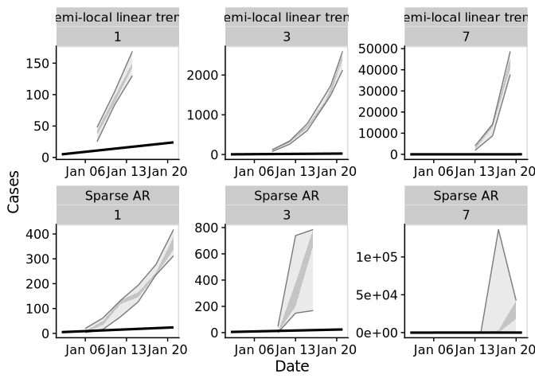

# EpiSoon

*Warning: This package is a work in progress and is currently developed
solely with the COVID-19 outbreak in mind. Breaking changes may occur
and the authors cannot guarantee support.*

**Aim:** To forecast the time-varying reproduction number and using this
to forecast reported case counts.

## Installation

Install the analysis and all dependencies with:

``` r
remotes::install_github("epiforecasts/EpiSoon", dependencies = TRUE)
```

## Quick start

  - Load the package (`bsts` for models, `ggplot2` for plotting, and
    `cowplot` for theming)

<!-- end list -->

``` r
library(EpiSoon)
library(bsts)
library(cowplot)
library(dplyr)
```

  - Define example observations.

<!-- end list -->

``` r
obs_rts <- data.frame(rt = 1:20,
                      date = as.Date("2020-01-01")
                      + lubridate::days(1:20))

obs_cases <- data.frame(cases = 5:24, 
                        date = as.Date("2020-01-01")
                        + lubridate::days(1:20))
```

  - Forecast a timeseries using a semi-local trend model and summarise
    it.

<!-- end list -->

``` r
samples <- forecast_rt(obs_rts[1:10, ],
                      model = function(ss, y){bsts::AddSemilocalLinearTrend(ss, y = y)},
                      horizon = 7, samples = 10)

 ## Summarise forecast
 summarised_forecast <- summarise_forecast(samples)
 
 summarised_forecast
#> # A tibble: 7 x 9
#>   date       horizon median  mean    sd bottom lower upper   top
#>   <date>       <int>  <dbl> <dbl> <dbl>  <dbl> <dbl> <dbl> <dbl>
#> 1 2020-01-12       1   11.1  11.1 0.150   10.9  11.0  11.2  11.3
#> 2 2020-01-13       2   12.0  12.1 0.377   11.6  11.9  12.1  13.0
#> 3 2020-01-14       3   13.0  13.1 0.353   12.8  12.9  13.2  14.0
#> 4 2020-01-15       4   14.0  14.2 0.575   13.4  13.8  14.1  15.4
#> 5 2020-01-16       5   15.0  15.3 0.603   14.7  14.7  15.0  16.5
#> 6 2020-01-17       6   16.0  16.3 0.656   15.7  15.7  16.0  17.5
#> 7 2020-01-18       7   16.9  17.2 0.625   16.7  16.7  16.9  18.4
```

  - Score the forecast

<!-- end list -->

``` r
scores <- score_forecast(samples, obs_rts)

summarise_scores(scores)
#> # A tibble: 5 x 8
#>   score      bottom   lower  median    mean  upper    top     sd
#>   <chr>       <dbl>   <dbl>   <dbl>   <dbl>  <dbl>  <dbl>  <dbl>
#> 1 bias       0.33    0.5     0.5     0.543   0.6    0.770 0.151 
#> 2 crps       0.0550  0.0636  0.0951  0.0974  0.132  0.140 0.0376
#> 3 dss       -3.05   -2.02   -1.12   -1.57   -0.915 -0.803 0.897 
#> 4 logs      -0.680  -0.586  -0.0247 -0.0672  0.446  0.520 0.551 
#> 5 sharpness  0.160   0.190   0.237   0.267   0.334  0.412 0.0996
```

  - Plot the forecast

<!-- end list -->

``` r
 ## Plot forecast
 plot_forecast(summarised_forecast, obs_rts)
```

<!-- -->

  - Iteratively fit the forecast and plot this to visualise the forecast
    quality

<!-- end list -->

``` r
forecast_eval <- evaluate_model(obs_rts = obs_rts,
                                obs_cases = obs_cases, 
                                model = function(ss, y){bsts::AddSemilocalLinearTrend(ss, y = y)},
                                horizon = 7, samples = 10)

forecast_rts <- forecast_eval$forecast_rts

 ## Plot forecast
 plot_forecast_evaluation(forecast_rts, obs_rts, horizon_to_plot = c(1, 3, 7)) +
   ggplot2::facet_wrap(~ horizon, ncol = 1) +
   cowplot::panel_border() 
#> Warning in horizon == horizon_to_plot: longer object length is not a multiple of
#> shorter object length
```

<!-- -->

``` r
 ## currently still returns warning: "longer object length is not a multiple of shorter object length"
   
```

## Evaluate across models

  - Define a list of models.

<!-- end list -->

``` r
## List of forecasting bsts models wrapped in functions.
models <- list("Sparse AR" = function(ss, y){bsts::AddAutoAr(ss, y = y, lags = 7)},
                "Semi-local linear trend" = function(ss, y){bsts::AddSemilocalLinearTrend(ss, y = y)})
```

  - Compare across models.

<!-- end list -->

``` r
evaluations <- compare_models(obs_rts = obs_rts, 
                              obs_cases = obs_cases, 
                              models = models, 
                              horizon = 7, samples = 10)
```

  - Plot evaluation of models over a set of time horizons.

<!-- end list -->

``` r
plot_forecast_evaluation(evaluations$forecast_rts, obs_rts, c(1, 3, 7)) +
   ggplot2::facet_grid(model ~ horizon) +
   cowplot::panel_border() 
#> Warning in horizon == horizon_to_plot: longer object length is not a multiple of
#> shorter object length
```

<!-- -->

  - Score across models

<!-- end list -->

``` r
summarise_scores(evaluations$rt_scores)
#> # A tibble: 10 x 9
#>    score    model               bottom   lower median   mean  upper   top     sd
#>    <chr>    <chr>                <dbl>   <dbl>  <dbl>  <dbl>  <dbl> <dbl>  <dbl>
#>  1 bias     Semi-local linear…  0.100   0.4     0.5    0.478  0.6    0.8   0.178
#>  2 bias     Sparse AR           0       0       0.100  0.116  0.200  0.4   0.127
#>  3 crps     Semi-local linear…  0.0518  0.0762  0.124  0.240  0.204  1.45  0.374
#>  4 crps     Sparse AR           0.317   1.29    2.41   3.23   4.27   9.44  2.57 
#>  5 dss      Semi-local linear… -3.38   -2.38   -1.79  -1.36  -0.682  3.00  1.58 
#>  6 dss      Sparse AR           0.640   2.65    4.10   9.14   6.29  71.9  17.4  
#>  7 logs     Semi-local linear… -0.643  -0.171   0.299  0.378  0.711  2.18  0.760
#>  8 logs     Sparse AR           1.13    2.21    2.80   7.36   3.82  54.5  20.9  
#>  9 sharpne… Semi-local linear…  0.118   0.267   0.422  0.569  0.650  2.28  0.520
#> 10 sharpne… Sparse AR           0.151   1.38    2.39   2.54   3.42   5.23  1.46
```

### Evaluate across regions and models

  - Define multiple timeseries

<!-- end list -->

``` r
obs_rts_ts <- obs_rts %>% 
   dplyr::mutate(timeseries = "Region 1") %>% 
   dplyr::bind_rows(
      obs_rts %>% 
   dplyr::mutate(timeseries = "Region 2")
   )

obs_cases_ts <- obs_cases %>% 
   dplyr::mutate(timeseries = "Region 1") %>% 
   dplyr::bind_rows(
      obs_cases %>% 
   dplyr::mutate(timeseries = "Region 2")
   )
```

  - Compare across regions and models

<!-- end list -->

``` r
evaluations <- compare_timeseries(obs_rts = obs_rts_ts, 
                                  obs_cases = obs_cases_ts, 
                                  models = models,
                                  horizon = 7, samples = 10)
```

  - Plot comparison

<!-- end list -->

``` r
plot_forecast_evaluation(evaluations$forecast_rts, obs_rts_ts, c(7)) +
   ggplot2::facet_grid(model ~ timeseries) +
   cowplot::panel_border()
```

<!-- -->

  - Summarise CRPS by region

<!-- end list -->

``` r
summarise_scores(evaluations$rt_scores, "timeseries", sel_scores = "crps")
#> # A tibble: 4 x 10
#>   timeseries score model            bottom  lower median  mean upper   top    sd
#>   <chr>      <chr> <chr>             <dbl>  <dbl>  <dbl> <dbl> <dbl> <dbl> <dbl>
#> 1 Region 1   crps  Semi-local line… 0.0340 0.0636 0.0911 0.155 0.162 0.584 0.158
#> 2 Region 1   crps  Sparse AR        0.357  1.13   2.94   3.30  5.06  8.29  2.36 
#> 3 Region 2   crps  Semi-local line… 0.0459 0.0797 0.110  0.148 0.164 0.546 0.127
#> 4 Region 2   crps  Sparse AR        0.369  1.34   2.86   3.36  4.78  8.70  2.48
```

  - Summarise logs by horizon

<!-- end list -->

``` r
summarise_scores(evaluations$rt_scores, "horizon", sel_scores = "logs")
#> # A tibble: 14 x 10
#>    horizon score model      bottom   lower  median    mean   upper    top     sd
#>      <int> <chr> <chr>       <dbl>   <dbl>   <dbl>   <dbl>   <dbl>  <dbl>  <dbl>
#>  1       1 logs  Semi-loca… -0.908 -0.659  -0.301  -0.271   0.0498  0.978  0.516
#>  2       1 logs  Sparse AR   1.10   1.37    1.66    2.19    2.28    6.03   2.03 
#>  3       2 logs  Semi-loca… -1.16  -0.619  -0.321  -0.233  -0.0169  1.16   0.638
#>  4       2 logs  Sparse AR   1.49   1.98    2.20    3.60    2.55   14.2    7.43 
#>  5       3 logs  Semi-loca… -0.837 -0.378  -0.0848  0.0613  0.235   1.58   0.679
#>  6       3 logs  Sparse AR   1.78   2.36    2.74    3.01    3.35    5.64   1.01 
#>  7       4 logs  Semi-loca… -0.631 -0.259   0.0125  0.180   0.474   1.59   0.635
#>  8       4 logs  Sparse AR   2.30   2.72    2.98    3.66    4.14    7.98   1.60 
#>  9       5 logs  Semi-loca… -0.411 -0.119   0.0832  0.278   0.430   1.69   0.616
#> 10       5 logs  Sparse AR   2.51   2.98    3.50    7.03    3.99   37.7   12.2  
#> 11       6 logs  Semi-loca… -0.377  0.0547  0.380   0.459   0.650   1.87   0.659
#> 12       6 logs  Sparse AR   2.98   3.33    3.81    9.14    4.62   51.7   18.2  
#> 13       7 logs  Semi-loca… -0.241  0.299   0.514   0.681   0.942   2.04   0.689
#> 14       7 logs  Sparse AR   3.22   3.82    4.39    7.33    6.18   24.9    6.70
```

## Docker

This package was developed in a docker container based on the
`rocker/geospatial` docker image.

To build the docker image run (from the `EpiSoon` directory):

``` bash
docker build . -t episoon
```

To run the docker image run:

``` bash
docker run -d -p 8787:8787 --name episoon -e USER=episoon -e PASSWORD=episoon episoon
```

The rstudio client can be found on port :8787 at your local machines ip.
The default username:password is epinow:epinow, set the user with -e
USER=username, and the password with - e PASSWORD=newpasswordhere. The
default is to save the analysis files into the user directory.

To mount a folder (from your current working directory - here assumed to
be `tmp`) in the docker container to your local system use the following
in the above docker run command (as given mounts the whole `episoon`
directory to `tmp`).

``` bash
--mount type=bind,source=$(pwd)/tmp,target=/home/EpiSoon
```

To access the command line run the following:

``` bash
docker exec -ti episoon bash
```
