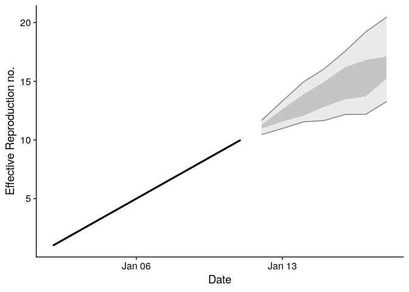
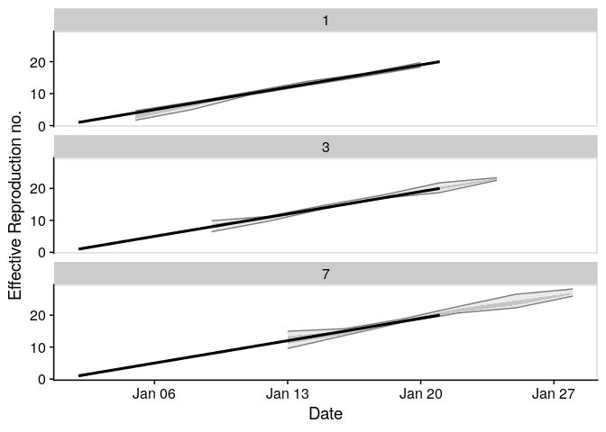
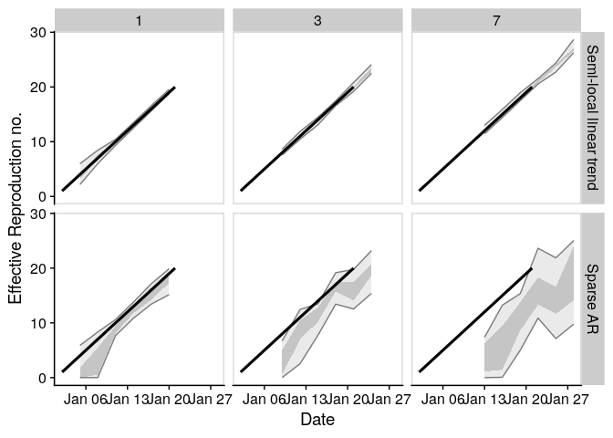
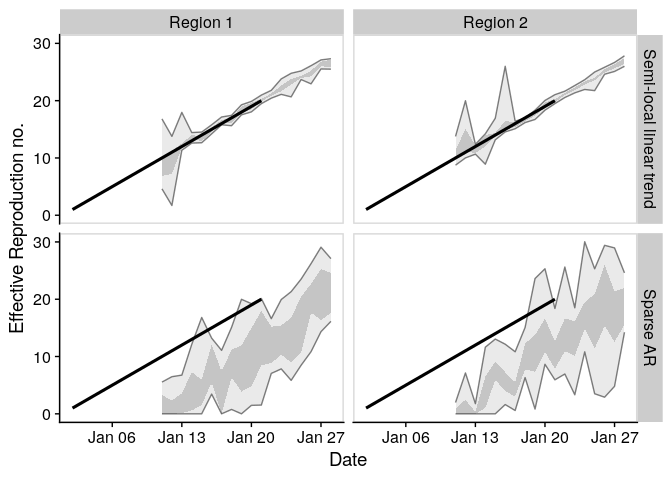

# EpiSoon

*Warning: This package is a work in progress and is currently developed
solely with the COVID-19 outbreak in mind. Breaking changes may occur
and the authors cannot guarantee support.*

**Aim:** To forecast the time-varying reproduction number and using this
to forecast reported case counts.

## Installation

Install the analysis and all dependencies with:

``` r
remotes::install_github("epiforecasts/EpiSoon", dependencies = TRUE)
```

## Quick start

  - Load the package (`bsts` for models, `ggplot2` for plotting, and
    `cowplot` for theming)

<!-- end list -->

``` r
library(EpiSoon)
library(bsts)
library(cowplot)
```

  - Define example observations.

<!-- end list -->

``` r
observations <- data.frame(rt = 1:20,
                           date = as.Date("2020-01-01")
                            + lubridate::days(1:20))
```

  - Forecast a timeseries using a semi-local trend model and summarise
    it.

<!-- end list -->

``` r
samples <- fit_model(observations[1:10, ],
                      model = function(ss, y){bsts::AddSemilocalLinearTrend(ss, y = y)},
                      horizon = 7, samples = 10)

 ## Summarise forecast
 summarised_forecast <- summarise_forecast(samples)
 
 summarised_forecast
```

    ## # A tibble: 7 x 9
    ##   date       horizon bottom lower median  mean upper   top    sd
    ##   <date>       <int>  <dbl> <dbl>  <dbl> <dbl> <dbl> <dbl> <dbl>
    ## 1 2020-01-12       1   10.4  11.0   11.2  11.1  11.3  11.7 0.373
    ## 2 2020-01-13       2   11.0  11.6   11.8  12.0  12.6  13.3 0.782
    ## 3 2020-01-14       3   11.5  12.1   13.0  13.0  13.9  14.9 1.22 
    ## 4 2020-01-15       4   11.7  12.8   13.6  13.8  15.0  16.1 1.56 
    ## 5 2020-01-16       5   12.2  13.5   14.6  14.7  16.2  17.5 1.91 
    ## 6 2020-01-17       6   12.2  13.7   15.4  15.4  16.8  19.2 2.41 
    ## 7 2020-01-18       7   13.3  15.2   16.3  16.4  17.1  20.5 2.36

  - Score the forecast

<!-- end list -->

``` r
scores <- score_model(samples, observations)

summarise_scores(scores)
```

    ## # A tibble: 5 x 8
    ##   score      bottom  lower median  mean upper   top    sd
    ##   <chr>       <dbl>  <dbl>  <dbl> <dbl> <dbl> <dbl> <dbl>
    ## 1 bias       0.4     0.4    0.4   0.457 0.45  0.67  0.113
    ## 2 crps       0.125   0.268  0.440 0.412 0.567 0.656 0.206
    ## 3 dss       -1.75   -0.154  0.811 0.452 1.45  1.71  1.34 
    ## 4 logs       0.0927  1.12   1.65  1.36  1.82  2.01  0.728
    ## 5 sharpness  0.269   1.07   1.60  1.53  2.07  2.56  0.854

  - Plot the forecast

<!-- end list -->

``` r
 ## Plot forecast
 plot_forecast(summarised_forecast, observations)
```

<!-- -->

  - Iteratively fit the forecast and plot this to visualise the forecast
    quality

<!-- end list -->

``` r
forecast_eval <- evaluate_model(observations,
                                 model = function(ss, y){bsts::AddSemilocalLinearTrend(ss, y = y)},
                                horizon = 7, samples = 10)

forecasts <- forecast_eval$forecasts

 ## Plot forecast
 plot_forecast_evaluation(forecasts, observations, horizon_to_plot = c(1, 3, 7)) +
   ggplot2::facet_wrap(~ horizon, ncol = 1) +
   cowplot::panel_border()
```

<!-- -->

## Evaluate across models

  - Define a list of models.

<!-- end list -->

``` r
## List of forecasting bsts models wrapped in functions.
models <- list("Sparse AR" = function(ss, y){bsts::AddAutoAr(ss, y = y, lags = 7)},
                "Semi-local linear trend" = function(ss, y){bsts::AddSemilocalLinearTrend(ss, y = y)})
```

  - Compare across
models.

<!-- end list -->

``` r
evaluations <- compare_models(observations, models, horizon = 7, samples = 10)
```

  - Plot evaluation of models over a set of time
horizons.

<!-- end list -->

``` r
plot_forecast_evaluation(evaluations$forecast, observations, c(1, 3, 7)) +
   ggplot2::facet_grid(model ~ horizon) +
   cowplot::panel_border()
```

<!-- -->

  - Score across models

<!-- end list -->

``` r
summarise_scores(evaluations$scores)
```

    ## # A tibble: 10 x 9
    ##    score    model               bottom   lower median   mean upper    top     sd
    ##    <chr>    <chr>                <dbl>   <dbl>  <dbl>  <dbl> <dbl>  <dbl>  <dbl>
    ##  1 bias     Semi-local linea…  0.100    0.3     0.5    0.454 0.6    0.7    0.172
    ##  2 bias     Sparse AR          0        0       0.100  0.117 0.200  0.415  0.131
    ##  3 crps     Semi-local linea…  0.0474   0.0918  0.138  0.219 0.226  1.02   0.227
    ##  4 crps     Sparse AR          0.407    1.29    2.53   3.45  5.43   9.64   2.71 
    ##  5 dss      Semi-local linea… -3.16    -1.95   -1.34  -0.883 0.148  2.57   1.62 
    ##  6 dss      Sparse AR          0.352    2.68    4.01   9.41  6.67  57.8   16.7  
    ##  7 logs     Semi-local linea… -0.812   -0.0322  0.357  0.428 0.823  2.36   0.757
    ##  8 logs     Sparse AR          1.25     2.36    2.89  13.9   3.72  82.9   60.7  
    ##  9 sharpne… Semi-local linea…  0.130    0.247   0.416  0.670 0.747  3.84   0.848
    ## 10 sharpne… Sparse AR          0.00897  1.30    2.24   2.45  3.24   5.89   1.55

### Evaluate across regions and models

  - Define a list of timeseries

<!-- end list -->

``` r
timeseries <- list(observations, observations)
names(timeseries) <- c("Region 1", "Region 2")
```

  - Compare across regions and models

<!-- end list -->

``` r
evaluations <- compare_timeseries(timeseries, models,
                                   horizon = 7, samples = 10)
```

  - Plot comparison

<!-- end list -->

``` r
plot_forecast_evaluation(evaluations$forecast, observations, c(7)) +
   ggplot2::facet_grid(model ~ region) +
   cowplot::panel_border()
```

<!-- -->

  - Summarise CRPS by region

<!-- end list -->

``` r
summarise_scores(evaluations$scores, "region", sel_scores = "crps")
```

    ## # A tibble: 4 x 10
    ##   region   score model              bottom  lower median  mean upper   top    sd
    ##   <chr>    <chr> <chr>               <dbl>  <dbl>  <dbl> <dbl> <dbl> <dbl> <dbl>
    ## 1 Region 1 crps  Semi-local linear… 0.0394 0.0877  0.140 0.193 0.257 0.584 0.152
    ## 2 Region 1 crps  Sparse AR          0.458  1.52    2.86  3.42  5.28  7.70  2.27 
    ## 3 Region 2 crps  Semi-local linear… 0.0494 0.100   0.154 0.285 0.333 1.16  0.308
    ## 4 Region 2 crps  Sparse AR          0.403  1.33    3.19  3.68  5.61  9.04  2.54

  - Summarise logs by horizon

<!-- end list -->

``` r
summarise_scores(evaluations$scores, "horizon", sel_scores = "logs")
```

    ## # A tibble: 14 x 10
    ##    horizon score model           bottom  lower median    mean  upper   top    sd
    ##      <int> <chr> <chr>            <dbl>  <dbl>  <dbl>   <dbl>  <dbl> <dbl> <dbl>
    ##  1       1 logs  Semi-local li… -0.872  -0.359 -0.170 -0.0890 0.0974  1.19 0.484
    ##  2       1 logs  Sparse AR       0.815   1.41   1.69   1.79   2.06    3.06 0.591
    ##  3       2 logs  Semi-local li… -0.974  -0.241  0.127  0.163  0.403   1.34 0.623
    ##  4       2 logs  Sparse AR       1.71    2.09   2.27   2.46   2.54    4.85 0.899
    ##  5       3 logs  Semi-local li… -0.817  -0.100  0.329  0.392  0.809   1.57 0.668
    ##  6       3 logs  Sparse AR       2.22    2.59   2.83   3.58   3.48    8.35 1.97 
    ##  7       4 logs  Semi-local li… -0.447   0.193  0.497  0.638  1.20    1.75 0.677
    ##  8       4 logs  Sparse AR       2.57    2.83   3.26   4.32   3.62   13.7  3.22 
    ##  9       5 logs  Semi-local li… -0.0621  0.240  0.558  0.803  1.30    2.06 0.681
    ## 10       5 logs  Sparse AR       2.86    3.33   3.81   6.33   4.36   26.4  8.03 
    ## 11       6 logs  Semi-local li… -0.328   0.342  0.593  0.857  1.31    2.29 0.778
    ## 12       6 logs  Sparse AR       3.19    3.69   3.99   6.53   5.39   19.9  5.41 
    ## 13       7 logs  Semi-local li…  0.122   0.510  1.24   1.14   1.62    2.58 0.753
    ## 14       7 logs  Sparse AR       3.30    3.86   4.86   6.39   6.82   19.7  4.73

## Docker

This package was developed in a docker container based on the
`rocker/geospatial` docker image.

To build the docker image run (from the `EpiSoon` directory):

``` bash
docker build . -t episoon
```

To run the docker image
run:

``` bash
docker run -d -p 8787:8787 --name episoon -e USER=episoon -e PASSWORD=episoon episoon
```

The rstudio client can be found on port :8787 at your local machines ip.
The default username:password is epinow:epinow, set the user with -e
USER=username, and the password with - e PASSWORD=newpasswordhere. The
default is to save the analysis files into the user directory.

To mount a folder (from your current working directory - here assumed to
be `tmp`) in the docker container to your local system use the following
in the above docker run command (as given mounts the whole `episoon`
directory to `tmp`).

``` bash
--mount type=bind,source=$(pwd)/tmp,target=/home/EpiSoon
```

To access the command line run the following:

``` bash
docker exec -ti episoon bash
```
