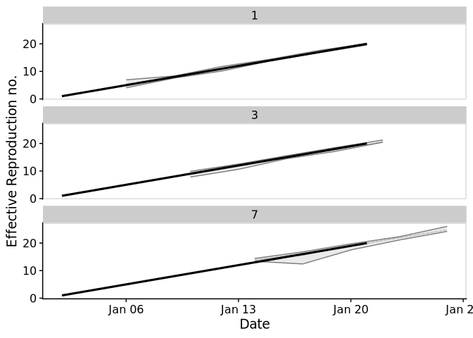

# EpiSoon

*Warning: This package is a work in progress and is currently developed
solely with the COVID-19 outbreak in mind. Breaking changes may occur
and the authors cannot guarantee support.*

**Aim:** To forecast the time-varying reproduction number and using this
to forecast reported case counts.

## Installation

Install the analysis and all dependencies with:

``` r
remotes::install_github("epiforecasts/EpiSoon", dependencies = TRUE)
```

## Quick start

  - Load the package (`bsts` for models, `ggplot2` for plotting, and
    `cowplot` for theming)

<!-- end list -->

``` r
library(EpiSoon)
library(bsts)
library(cowplot)
library(dplyr)
```

  - Define example observations.

<!-- end list -->

``` r
observations <- data.frame(rt = 1:20,
                           date = as.Date("2020-01-01")
                            + lubridate::days(1:20))
```

  - Forecast a timeseries using a semi-local trend model and summarise
    it.

<!-- end list -->

``` r
samples <- forecast_rt(observations[1:10, ],
                      model = function(ss, y){bsts::AddSemilocalLinearTrend(ss, y = y)},
                      horizon = 7, samples = 10)

 ## Summarise forecast
 summarised_forecast <- summarise_forecast(samples)
 
 summarised_forecast
#> # A tibble: 7 x 9
#>   date       horizon bottom lower median  mean upper   top    sd
#>   <date>       <int>  <dbl> <dbl>  <dbl> <dbl> <dbl> <dbl> <dbl>
#> 1 2020-01-12       1   10.8  10.9   11.0  11.0  11.1  11.2 0.146
#> 2 2020-01-13       2   11.7  12.0   12.1  12.1  12.2  12.4 0.212
#> 3 2020-01-14       3   12.3  12.5   12.8  12.8  13.1  13.6 0.451
#> 4 2020-01-15       4   13.2  13.6   13.8  13.9  14.1  14.9 0.541
#> 5 2020-01-16       5   14.6  14.7   14.9  15.0  15.2  16.2 0.567
#> 6 2020-01-17       6   15.4  15.6   15.9  16.1  16.3  17.5 0.696
#> 7 2020-01-18       7   16.4  16.8   17.1  17.2  17.3  18.4 0.640
```

  - Score the forecast

<!-- end list -->

``` r
scores <- score_forecast(samples, observations)

summarise_scores(scores)
#> # A tibble: 5 x 8
#>   score      bottom   lower median    mean  upper    top     sd
#>   <chr>       <dbl>   <dbl>  <dbl>   <dbl>  <dbl>  <dbl>  <dbl>
#> 1 bias       0.4     0.4     0.4    0.486   0.6    0.6   0.107 
#> 2 crps       0.0387  0.0836  0.116  0.106   0.136  0.146 0.0427
#> 3 dss       -3.82   -2.33   -1.31  -1.84   -1.08  -0.837 1.20  
#> 4 logs      -0.803  -0.172   0.216  0.0241  0.345  0.443 0.502 
#> 5 sharpness  0.151   0.310   0.428  0.388   0.468  0.577 0.160
```

  - Plot the forecast

<!-- end list -->

``` r
 ## Plot forecast
 plot_forecast(summarised_forecast, observations)
```

<!-- -->

  - Iteratively fit the forecast and plot this to visualise the forecast
    quality

<!-- end list -->

``` r
forecast_eval <- evaluate_model(observations,
                                 model = function(ss, y){bsts::AddSemilocalLinearTrend(ss, y = y)},
                                horizon = 7, samples = 10)

forecasts <- forecast_eval$forecasts

 ## Plot forecast
 plot_forecast_evaluation(forecasts, observations, horizon_to_plot = c(1, 3, 7)) +
   ggplot2::facet_wrap(~ horizon, ncol = 1) +
   cowplot::panel_border()
```

<!-- -->

## Evaluate across models

  - Define a list of models.

<!-- end list -->

``` r
## List of forecasting bsts models wrapped in functions.
models <- list("Sparse AR" = function(ss, y){bsts::AddAutoAr(ss, y = y, lags = 7)},
                "Semi-local linear trend" = function(ss, y){bsts::AddSemilocalLinearTrend(ss, y = y)})
```

  - Compare across
models.

<!-- end list -->

``` r
evaluations <- compare_models(observations, models, horizon = 7, samples = 10)
```

  - Plot evaluation of models over a set of time
horizons.

<!-- end list -->

``` r
plot_forecast_evaluation(evaluations$forecast, observations, c(1, 3, 7)) +
   ggplot2::facet_grid(model ~ horizon) +
   cowplot::panel_border()
```

<!-- -->

  - Score across models

<!-- end list -->

``` r
summarise_scores(evaluations$scores)
#> # A tibble: 10 x 9
#>    score    model            bottom   lower median    mean  upper    top      sd
#>    <chr>    <chr>             <dbl>   <dbl>  <dbl>   <dbl>  <dbl>  <dbl>   <dbl>
#>  1 bias     Semi-local lin…  0.200   0.4     0.5     0.512  0.6    0.9     0.194
#>  2 bias     Sparse AR        0       0       0.150   0.147  0.200  0.358   0.125
#>  3 crps     Semi-local lin…  0.0485  0.0869  0.138   0.182  0.216  0.673   0.165
#>  4 crps     Sparse AR        0.428   1.28    2.74    3.31   4.99   8.39    2.41 
#>  5 dss      Semi-local lin… -3.45   -2.25   -1.42   -1.29  -0.504  2.08    1.35 
#>  6 dss      Sparse AR        0.599   2.65    4.05    9.77   6.24  41.8    24.7  
#>  7 logs     Semi-local lin… -0.722  -0.115   0.265   0.307  0.646  1.94    0.659
#>  8 logs     Sparse AR        1.10    2.25    2.98  Inf      3.67  24.5   Inf    
#>  9 sharpne… Semi-local lin…  0.130   0.243   0.359   0.476  0.521  1.73    0.438
#> 10 sharpne… Sparse AR        0       1.61    2.53    2.86   4.20   6.63    1.81
```

### Evaluate across regions and models

  - Define multiple timeseries each with multiple samples

<!-- end list -->

``` r
timeseries <- observations %>% 
   dplyr::mutate(timeseries = "Region 1", sample = 1) %>% 
   {dplyr::bind_rows(., dplyr::mutate(., sample = 2))} %>% 
   dplyr::bind_rows(
      observations %>% 
   dplyr::mutate(timeseries = "Region 2", sample = 1) %>% 
   {dplyr::bind_rows(., dplyr::mutate(., sample = 2))}
   )
```

  - Compare across regions and models

<!-- end list -->

``` r
evaluations <- compare_timeseries(timeseries, models,
                                   horizon = 7, samples = 10)
```

  - Plot comparison

<!-- end list -->

``` r
plot_forecast_evaluation(evaluations$forecast, observations, c(7)) +
   ggplot2::facet_grid(model ~ timeseries) +
   cowplot::panel_border()
```

<!-- -->

  - Summarise CRPS by region

<!-- end list -->

``` r
summarise_scores(evaluations$scores, "timeseries", sel_scores = "crps")
#> # A tibble: 4 x 10
#>   timeseries score model            bottom  lower median  mean upper   top    sd
#>   <chr>      <chr> <chr>             <dbl>  <dbl>  <dbl> <dbl> <dbl> <dbl> <dbl>
#> 1 Region 1   crps  Semi-local line… 0.0434 0.0963  0.142 0.194 0.233 0.735 0.161
#> 2 Region 1   crps  Sparse AR        0.448  1.48    3.28  3.63  5.36  8.21  2.39 
#> 3 Region 2   crps  Semi-local line… 0.0489 0.0902  0.133 0.208 0.229 0.844 0.199
#> 4 Region 2   crps  Sparse AR        0.339  1.40    2.93  3.29  4.89  8.63  2.28
```

  - Summarise logs by horizon

<!-- end list -->

``` r
summarise_scores(evaluations$scores, "horizon", sel_scores = "logs")
#> # A tibble: 14 x 10
#>    horizon score model         bottom   lower median    mean upper   top      sd
#>      <int> <chr> <chr>          <dbl>   <dbl>  <dbl>   <dbl> <dbl> <dbl>   <dbl>
#>  1       1 logs  Semi-local l… -1.13  -0.518  -0.201  -0.141 0.212  1.00   0.565
#>  2       1 logs  Sparse AR      0.913  1.43    1.84    1.88  2.31   3.04   0.596
#>  3       2 logs  Semi-local l… -0.770 -0.277   0.154   0.130 0.410  1.26   0.516
#>  4       2 logs  Sparse AR      1.59   2.01    2.33    2.58  2.83   5.91   1.07 
#>  5       3 logs  Semi-local l… -0.715 -0.0797  0.280   0.361 0.718  1.64   0.644
#>  6       3 logs  Sparse AR      2.03   2.55    2.79    5.38  3.24  14.5   16.4  
#>  7       4 logs  Semi-local l… -0.668  0.0262  0.404   0.504 0.823  2.02   0.666
#>  8       4 logs  Sparse AR      2.36   2.97    3.20  Inf     4.07  36.7  Inf    
#>  9       5 logs  Semi-local l… -0.777  0.272   0.611   0.683 0.952  2.09   0.663
#> 10       5 logs  Sparse AR      2.73   3.28    3.63    6.74  4.75  17.9   14.8  
#> 11       6 logs  Semi-local l… -0.676  0.220   0.704   0.726 1.23   2.14   0.766
#> 12       6 logs  Sparse AR      3.05   3.51    3.92   10.9   5.04  40.5   32.2  
#> 13       7 logs  Semi-local l… -0.160  0.438   0.786   0.932 1.33   2.30   0.735
#> 14       7 logs  Sparse AR      3.04   3.74    4.21   10.0   5.20  34.0   26.5
```

## Docker

This package was developed in a docker container based on the
`rocker/geospatial` docker image.

To build the docker image run (from the `EpiSoon` directory):

``` bash
docker build . -t episoon
```

To run the docker image
run:

``` bash
docker run -d -p 8787:8787 --name episoon -e USER=episoon -e PASSWORD=episoon episoon
```

The rstudio client can be found on port :8787 at your local machines ip.
The default username:password is epinow:epinow, set the user with -e
USER=username, and the password with - e PASSWORD=newpasswordhere. The
default is to save the analysis files into the user directory.

To mount a folder (from your current working directory - here assumed to
be `tmp`) in the docker container to your local system use the following
in the above docker run command (as given mounts the whole `episoon`
directory to `tmp`).

``` bash
--mount type=bind,source=$(pwd)/tmp,target=/home/EpiSoon
```

To access the command line run the following:

``` bash
docker exec -ti episoon bash
```
