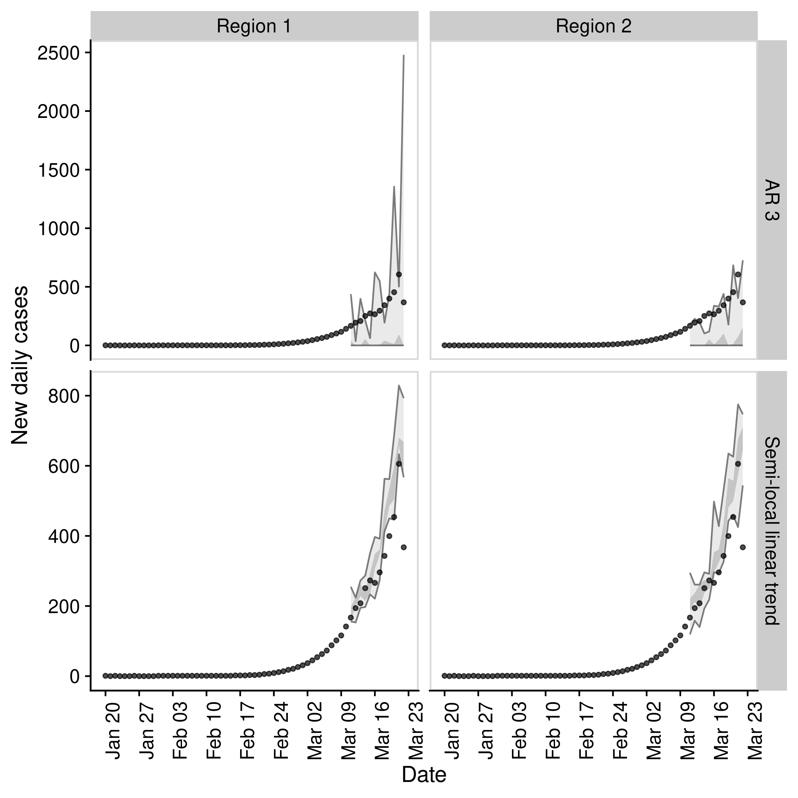

# EpiSoon

[](https://travis-ci.com/epiforecasts/EpiSoon)

*Warning: This package is a work in progress and is currently developed
solely with the COVID-19 outbreak in mind. Breaking changes may occur
and the authors cannot guarantee support.*

**Aim:** To forecast the time-varying reproduction number and using this
to forecast reported case counts.

## Installation

Install the analysis and all dependencies with:

``` r
remotes::install_github("epiforecasts/EpiSoon", dependencies = TRUE)
```

## Quick start

  - Load packages (`bsts` and `fable` for models, `ggplot2` for
    plotting, and `cowplot` for theming)

<!-- end list -->

``` r
library(EpiSoon)
library(bsts)
library(fable)
library(future)
library(cowplot)
library(dplyr)
```

  - Set up example data (using `EpiSoon::example_obs_rts` and
    `EpiSoon::example_obs_cases` as starting data sets). When generating
    timeseries with `EpiNow` use `get_timeseries` to extract the
    required data.

<!-- end list -->

``` r
obs_rts <- EpiSoon::example_obs_rts %>%
   dplyr::mutate(timeseries = "Region 1") %>%
   dplyr::bind_rows(EpiSoon::example_obs_rts %>%
  dplyr::mutate(timeseries = "Region 2"))

obs_cases <- EpiSoon::example_obs_cases %>%
   dplyr::mutate(timeseries = "Region 1") %>%
   dplyr::bind_rows(EpiSoon::example_obs_cases %>%
   dplyr::mutate(timeseries = "Region 2"))
```

  - Define the list of models to be compared.

<!-- end list -->

``` r
models <- list("AR 3" =
                    function(...) {EpiSoon::bsts_model(model =
                     function(ss, y){bsts::AddAr(ss, y = y, lags = 3)}, ...)},
                "Semi-local linear trend" =
                function(...) {EpiSoon::bsts_model(model =
                    function(ss, y){bsts::AddSemilocalLinearTrend(ss, y = y)}, ...)},
               "ARIMA" = 
                  function(...){EpiSoon::fable_model(model = fable::ARIMA(y ~ time), ...)})
```

  - Compare models across timeseries (change the `future::plan` to do
    this in parallel).

<!-- end list -->

``` r
future::plan("sequential")

## Compare models
forecasts <- EpiSoon::compare_timeseries(obs_rts, obs_cases, models,
                                         horizon = 7, samples = 10,
                                         serial_interval = EpiSoon::example_serial_interval)
#> Warning: Unknown or uninitialised column: 'sample'.

#> Warning: Unknown or uninitialised column: 'sample'.

forecasts
#> $forecast_rts
#> # A tibble: 497 x 12
#>    timeseries model forecast_date date       horizon median  mean     sd bottom
#>    <chr>      <chr> <chr>         <date>       <int>  <dbl> <dbl>  <dbl>  <dbl>
#>  1 Region 1   AR 3  2020-03-04    2020-03-05       1   2.23  2.22 0.0265   2.18
#>  2 Region 1   AR 3  2020-03-04    2020-03-06       2   2.15  2.15 0.0325   2.10
#>  3 Region 1   AR 3  2020-03-04    2020-03-07       3   2.07  2.06 0.0489   1.95
#>  4 Region 1   AR 3  2020-03-04    2020-03-08       4   1.97  1.98 0.0668   1.90
#>  5 Region 1   AR 3  2020-03-04    2020-03-09       5   1.87  1.87 0.0443   1.78
#>  6 Region 1   AR 3  2020-03-04    2020-03-10       6   1.83  1.82 0.0441   1.77
#>  7 Region 1   AR 3  2020-03-04    2020-03-11       7   1.75  1.75 0.0386   1.69
#>  8 Region 1   AR 3  2020-03-07    2020-03-08       1   2.07  2.07 0.0237   2.04
#>  9 Region 1   AR 3  2020-03-07    2020-03-09       2   2.02  2.02 0.0301   1.99
#> 10 Region 1   AR 3  2020-03-07    2020-03-10       3   1.97  1.98 0.0303   1.93
#> # … with 487 more rows, and 3 more variables: lower <dbl>, upper <dbl>,
#> #   top <dbl>
#> 
#> $rt_scores
#> # A tibble: 385 x 10
#>    timeseries model forecast_date date       horizon   dss   crps   logs  bias
#>    <chr>      <chr> <chr>         <date>       <int> <dbl>  <dbl>  <dbl> <dbl>
#>  1 Region 1   AR 3  2020-03-04    2020-03-05       1 -3.36 0.0373 -1.05  0    
#>  2 Region 1   AR 3  2020-03-04    2020-03-06       2 -4.94 0.0273 -1.83  0.100
#>  3 Region 1   AR 3  2020-03-04    2020-03-07       3 -2.30 0.0658 -0.519 0    
#>  4 Region 1   AR 3  2020-03-04    2020-03-08       4 -1.80 0.0872 -0.575 0.100
#>  5 Region 1   AR 3  2020-03-04    2020-03-09       5 14.7  0.170   9.40  0    
#>  6 Region 1   AR 3  2020-03-04    2020-03-10       6 17.0  0.179   9.64  0    
#>  7 Region 1   AR 3  2020-03-04    2020-03-11       7 44.2  0.240  30.3   0    
#>  8 Region 1   AR 3  2020-03-07    2020-03-08       1 -5.27 0.0234 -1.90  0.200
#>  9 Region 1   AR 3  2020-03-07    2020-03-09       2 -5.66 0.0244 -1.77  0.100
#> 10 Region 1   AR 3  2020-03-07    2020-03-10       3 -4.71 0.0334 -0.779 0.100
#> # … with 375 more rows, and 1 more variable: sharpness <dbl>
#> 
#> $forecast_cases
#> # A tibble: 385 x 12
#>    timeseries model forecast_date date       horizon median  mean    sd bottom
#>    <chr>      <chr> <chr>         <date>       <int>  <dbl> <dbl> <dbl>  <dbl>
#>  1 Region 1   AR 3  2020-03-04    2020-03-05       1   58.5  58.1 10.8      39
#>  2 Region 1   AR 3  2020-03-04    2020-03-06       2   64    62.8  9.00     49
#>  3 Region 1   AR 3  2020-03-04    2020-03-07       3   76    78.2  7.18     70
#>  4 Region 1   AR 3  2020-03-04    2020-03-08       4   86    85.9 10.0      71
#>  5 Region 1   AR 3  2020-03-04    2020-03-09       5   88    87.7 13.6      67
#>  6 Region 1   AR 3  2020-03-04    2020-03-10       6  102   106.  16.8      84
#>  7 Region 1   AR 3  2020-03-04    2020-03-11       7  112.  113.  15.4      92
#>  8 Region 1   AR 3  2020-03-07    2020-03-08       1   86.5  86.7  4.52     80
#>  9 Region 1   AR 3  2020-03-07    2020-03-09       2  104   106.  11.8      92
#> 10 Region 1   AR 3  2020-03-07    2020-03-10       3  114.  117.  13.5      97
#> # … with 375 more rows, and 3 more variables: lower <dbl>, upper <dbl>,
#> #   top <dbl>
#> 
#> $case_scores
#> # A tibble: 385 x 11
#>    timeseries model sample forecast_date date       horizon   dss  crps  logs
#>    <chr>      <chr> <chr>  <chr>         <date>       <int> <dbl> <dbl> <dbl>
#>  1 Region 1   AR 3  1      2020-03-04    2020-03-05       1  4.88  3.21  3.35
#>  2 Region 1   AR 3  1      2020-03-04    2020-03-06       2  5.72  6.14  3.66
#>  3 Region 1   AR 3  1      2020-03-04    2020-03-07       3  5.91  6.22  3.56
#>  4 Region 1   AR 3  1      2020-03-04    2020-03-08       4  7.36 10.6   4.12
#>  5 Region 1   AR 3  1      2020-03-04    2020-03-09       5  9.95 21.4   4.83
#>  6 Region 1   AR 3  1      2020-03-04    2020-03-10       6 10.6  28.1   5.35
#>  7 Region 1   AR 3  1      2020-03-04    2020-03-11       7 18.9  46.4   9.53
#>  8 Region 1   AR 3  1      2020-03-07    2020-03-08       1 15.6  12.8   8.36
#>  9 Region 1   AR 3  1      2020-03-07    2020-03-09       2  5.71  8.25  4.63
#> 10 Region 1   AR 3  1      2020-03-07    2020-03-10       3  8.86 17.8   4.78
#> # … with 375 more rows, and 2 more variables: bias <dbl>, sharpness <dbl>
```

  - Plot an evaluation of Rt forecasts using iterative
fitting.

<!-- end list -->

``` r
EpiSoon::plot_forecast_evaluation(forecasts$forecast_rts, obs_rts, c(7)) +
   ggplot2::facet_grid(model ~ timeseries) +
   cowplot::panel_border()
```



  - Plot an evaluation of case forecasts using iterative
fitting

<!-- end list -->

``` r
EpiSoon::plot_forecast_evaluation(forecasts$forecast_cases, obs_cases, c(7)) +
   ggplot2::facet_grid(model ~ timeseries, scales = "free") +
   cowplot::panel_border()
```


  - Summarise the forecasts by model scored against observed cases

<!-- end list -->

``` r
EpiSoon::summarise_scores(forecasts$case_scores)
#> # A tibble: 10 x 9
#>    score     model                 bottom lower median   mean upper   top     sd
#>    <chr>     <chr>                  <dbl> <dbl>  <dbl>  <dbl> <dbl> <dbl>  <dbl>
#>  1 bias      AR 3                    0     0     0.100  0.274  0.5    1    0.370
#>  2 bias      Semi-local linear tr…   0     0     0.100  0.3    0.5    1    0.351
#>  3 crps      AR 3                    3.91 12.8  21.9   37.4   44.5  157.  39.6  
#>  4 crps      Semi-local linear tr…   2.85  9.17 19.3   32.7   36.6  163.  39.7  
#>  5 dss       AR 3                    5.41  7.25  9.77  15.0   15.5   47.9 19.7  
#>  6 dss       Semi-local linear tr…   4.30  6.71  8.59  13.1   12.9   50.9 13.6  
#>  7 logs      AR 3                    3.55  4.62  5.35  10.7    8.39  45.4 16.8  
#>  8 logs      Semi-local linear tr…   3.31  4.34  5.13   9.92   6.94  45.1 19.8  
#>  9 sharpness AR 3                    4.71 11.1  16.3   19.4   25.9   48.1 11.5  
#> 10 sharpness Semi-local linear tr…   5.93 10.6  16.3   19.5   25.2   49.7 12.5
```

## Docker

This package was developed in a docker container based on the
`rocker/geospatial` docker image.

To build the docker image run (from the `EpiSoon` directory):

``` bash
docker build . -t episoon
```

To run the docker image
run:

``` bash
docker run -d -p 8787:8787 --name episoon -e USER=episoon -e PASSWORD=episoon episoon
```

The rstudio client can be found on port :8787 at your local machines ip.
The default username:password is epinow:epinow, set the user with -e
USER=username, and the password with - e PASSWORD=newpasswordhere. The
default is to save the analysis files into the user directory.

To mount a folder (from your current working directory - here assumed to
be `tmp`) in the docker container to your local system use the following
in the above docker run command (as given mounts the whole `episoon`
directory to `tmp`).

``` bash
--mount type=bind,source=$(pwd)/tmp,target=/home/EpiSoon
```

To access the command line run the following:

``` bash
docker exec -ti episoon bash
```
