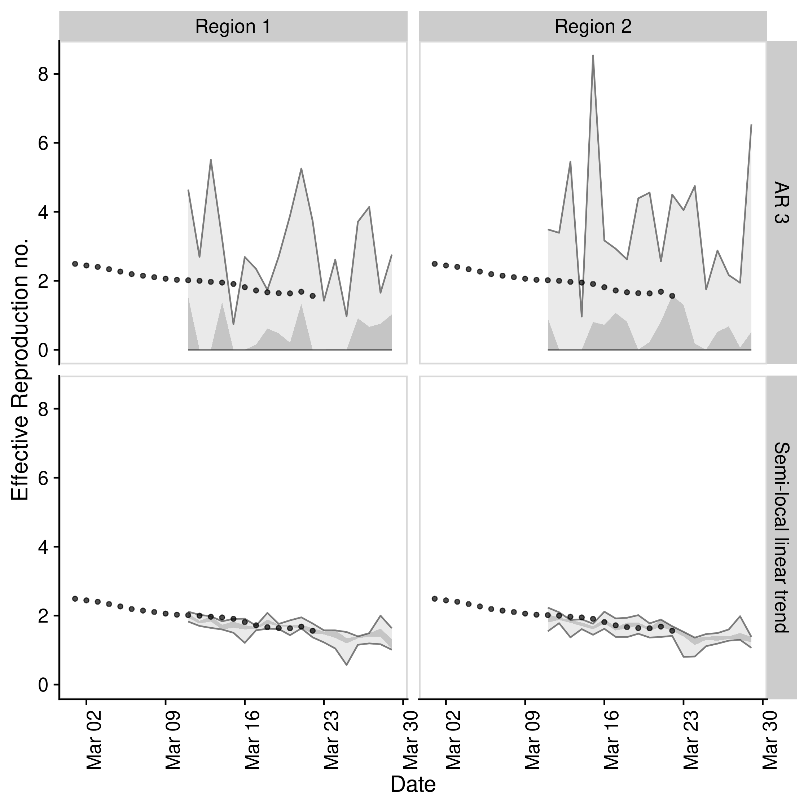

# EpiSoon

[](https://zenodo.org/badge/latestdoi/248311916)
[](https://github.com/epiforecasts/EpiSoon)
[](https://travis-ci.com/epiforecasts/EpiSoon)

**Aim:** To forecast the time-varying reproduction number and use this
to forecast reported case counts.

## Installation

Install the stable version of the package using
[`{drat}`](https://epiforecasts.io/drat/):

``` r
install.packages("drat")
drat::add("epiforecasts")
install.packages("EpiSoon")
```

Install the development version of the package with:

``` r
remotes::install_github("epiforecasts/EpiSoon")
```

## Quick start

  - Load packages (`bsts` and `fable` for models, `ggplot2` for
    plotting, and `cowplot` for theming)

<!-- end list -->

``` r
library(EpiSoon)
library(bsts)
library(fable)
#> Warning in system("timedatectl", intern = TRUE): running command 'timedatectl'
#> had status 1
library(future)
library(cowplot)
library(dplyr)
```

  - Set up example data (using `EpiSoon::example_obs_rts` and
    `EpiSoon::example_obs_cases` as starting data sets). When generating
    timeseries with `EpiNow` use `get_timeseries` to extract the
    required data.

<!-- end list -->

``` r
obs_rts <- EpiSoon::example_obs_rts %>%
   dplyr::mutate(timeseries = "Region 1") %>%
   dplyr::bind_rows(EpiSoon::example_obs_rts %>%
  dplyr::mutate(timeseries = "Region 2"))

obs_cases <- EpiSoon::example_obs_cases %>%
   dplyr::mutate(timeseries = "Region 1") %>%
   dplyr::bind_rows(EpiSoon::example_obs_cases %>%
   dplyr::mutate(timeseries = "Region 2"))
```

  - Define the list of models to be compared.

<!-- end list -->

``` r
models <- list("AR 3" =
                function(...) {EpiSoon::bsts_model(model =
                     function(ss, y){bsts::AddAr(ss, y = y, lags = 3)}, ...)},
               "Semi-local linear trend" =
                function(...) {EpiSoon::bsts_model(model =
                    function(ss, y){bsts::AddSemilocalLinearTrend(ss, y = y)}, ...)},
               "ARIMA" = 
                    function(...){EpiSoon::fable_model(model = fable::ARIMA(y ~ time), ...)})
```

  - Compare models across timeseries (change the `future::plan` to do
    this in parallel).

<!-- end list -->

``` r
future::plan("sequential")

## Compare models
forecasts <- EpiSoon::compare_timeseries(obs_rts, obs_cases, models,
                                         horizon = 7, samples = 10,
                                         serial_interval = EpiSoon::example_serial_interval)
#> Warning: Unknown or uninitialised column: `sample`.

#> Warning: Unknown or uninitialised column: `sample`.

forecasts
#> $forecast_rts
#> # A tibble: 532 x 12
#>    timeseries model forecast_date date       horizon median  mean    sd bottom
#>    <chr>      <chr> <chr>         <date>       <int>  <dbl> <dbl> <dbl>  <dbl>
#>  1 Region 1   AR 3  2020-03-04    2020-03-05       1 1.60   1.63   1.77      0
#>  2 Region 1   AR 3  2020-03-04    2020-03-06       2 0.0328 1.22   2.52      0
#>  3 Region 1   AR 3  2020-03-04    2020-03-07       3 0.0452 0.901  1.48      0
#>  4 Region 1   AR 3  2020-03-04    2020-03-08       4 0      0.433  1.02      0
#>  5 Region 1   AR 3  2020-03-04    2020-03-09       5 0.641  1.62   2.33      0
#>  6 Region 1   AR 3  2020-03-04    2020-03-10       6 1.33   1.99   2.55      0
#>  7 Region 1   AR 3  2020-03-04    2020-03-11       7 1.36   2.72   3.59      0
#>  8 Region 1   AR 3  2020-03-05    2020-03-06       1 0.484  1.19   1.51      0
#>  9 Region 1   AR 3  2020-03-05    2020-03-07       2 0      0.850  2.25      0
#> 10 Region 1   AR 3  2020-03-05    2020-03-08       3 0.796  1.14   1.31      0
#> # … with 522 more rows, and 3 more variables: lower <dbl>, upper <dbl>,
#> #   top <dbl>
#> 
#> $rt_scores
#> # A tibble: 420 x 14
#>    timeseries model forecast_date date       horizon   dss  crps   logs   bias
#>    <chr>      <chr> <chr>         <date>       <int> <dbl> <dbl>  <dbl>  <dbl>
#>  1 Region 1   AR 3  2020-03-04    2020-03-05       1  1.19 0.668   1.84 -0.6  
#>  2 Region 1   AR 3  2020-03-04    2020-03-06       2  1.91 1.38   17.6  -0.6  
#>  3 Region 1   AR 3  2020-03-04    2020-03-07       3  1.46 1.06    2.20 -0.6  
#>  4 Region 1   AR 3  2020-03-04    2020-03-08       4  2.91 1.51  Inf    -0.8  
#>  5 Region 1   AR 3  2020-03-04    2020-03-09       5  1.62 0.722   1.88 -0.400
#>  6 Region 1   AR 3  2020-03-04    2020-03-10       6  1.77 0.632   1.85 -0.200
#>  7 Region 1   AR 3  2020-03-04    2020-03-11       7  2.49 0.736   1.91 -0.400
#>  8 Region 1   AR 3  2020-03-05    2020-03-06       1  1.21 0.867   2.06 -0.6  
#>  9 Region 1   AR 3  2020-03-05    2020-03-07       2  1.88 1.58   57.4  -0.8  
#> 10 Region 1   AR 3  2020-03-05    2020-03-08       3  1.04 0.690   1.69 -0.6  
#> # … with 410 more rows, and 5 more variables: sharpness <dbl>,
#> #   calibration <dbl>, median <dbl>, iqr <dbl>, ci <dbl>
#> 
#> $forecast_cases
#> # A tibble: 420 x 12
#>    timeseries model forecast_date date       horizon median  mean    sd bottom
#>    <chr>      <chr> <chr>         <date>       <int>  <dbl> <dbl> <dbl>  <dbl>
#>  1 Region 1   AR 3  2020-03-04    2020-03-05       1   48    48.9  50.1      0
#>  2 Region 1   AR 3  2020-03-04    2020-03-06       2    1    47.8 100.       0
#>  3 Region 1   AR 3  2020-03-04    2020-03-07       3    3.5  33.5  54.6      0
#>  4 Region 1   AR 3  2020-03-04    2020-03-08       4    0    15.4  36.0      0
#>  5 Region 1   AR 3  2020-03-04    2020-03-09       5   27.5  81.1 158.       0
#>  6 Region 1   AR 3  2020-03-04    2020-03-10       6   15.5  60.7 110.       0
#>  7 Region 1   AR 3  2020-03-04    2020-03-11       7   53.5 126.  202.       0
#>  8 Region 1   AR 3  2020-03-05    2020-03-06       1   20    44.9  56.9      0
#>  9 Region 1   AR 3  2020-03-05    2020-03-07       2    0    34.5  86.3      0
#> 10 Region 1   AR 3  2020-03-05    2020-03-08       3   37    41.4  44.2      0
#> # … with 410 more rows, and 3 more variables: lower <dbl>, upper <dbl>,
#> #   top <dbl>
#> 
#> $case_scores
#> # A tibble: 420 x 15
#>    timeseries model sample forecast_date date       horizon   dss  crps   logs
#>    <chr>      <chr> <chr>  <chr>         <date>       <int> <dbl> <dbl>  <dbl>
#>  1 Region 1   AR 3  1      2020-03-04    2020-03-05       1  7.81  15.6   5.19
#>  2 Region 1   AR 3  1      2020-03-04    2020-03-06       2  9.18  44.8  11.3 
#>  3 Region 1   AR 3  1      2020-03-04    2020-03-07       3  9.00  44.4   5.88
#>  4 Region 1   AR 3  1      2020-03-04    2020-03-08       4 13.5   75.2 Inf   
#>  5 Region 1   AR 3  1      2020-03-04    2020-03-09       5 10.1   55.1   6.24
#>  6 Region 1   AR 3  1      2020-03-04    2020-03-10       6  9.89  79.1   7.07
#>  7 Region 1   AR 3  1      2020-03-04    2020-03-11       7 10.6   72.0   6.72
#>  8 Region 1   AR 3  1      2020-03-05    2020-03-06       1  8.25  26.4   5.53
#>  9 Region 1   AR 3  1      2020-03-05    2020-03-07       2  9.24  62.3  29.9 
#> 10 Region 1   AR 3  1      2020-03-05    2020-03-08       3  9.56  38.7   5.24
#> # … with 410 more rows, and 6 more variables: bias <dbl>, sharpness <dbl>,
#> #   calibration <dbl>, median <dbl>, iqr <dbl>, ci <dbl>
```

  - Plot an evaluation of Rt forecasts using iterative
fitting.

<!-- end list -->

``` r
EpiSoon::plot_forecast_evaluation(forecasts$forecast_rts, obs_rts, c(7)) +
   ggplot2::facet_grid(model ~ timeseries) +
   cowplot::panel_border()
```



  - Plot an evaluation of case forecasts using iterative
fitting

<!-- end list -->

``` r
EpiSoon::plot_forecast_evaluation(forecasts$forecast_cases, obs_cases, c(7)) +
   ggplot2::facet_grid(model ~ timeseries, scales = "free") +
   cowplot::panel_border()
```


  - Summarise the forecasts by model scored against observed cases

<!-- end list -->

``` r
EpiSoon::summarise_scores(forecasts$case_scores)
#> # A tibble: 18 x 9
#>    score  model   bottom    lower   median      mean    upper       top       sd
#>    <chr>  <chr>    <dbl>    <dbl>    <dbl>     <dbl>    <dbl>     <dbl>    <dbl>
#>  1 bias   AR 3  -1.00e+0 -8.00e-1 -7.50e-1   -0.652  -4.00e-1   -0.0450    0.261
#>  2 bias   Semi… -1.00e+0  2.00e-1  8.00e-1    0.506   1.00e+0    1         0.580
#>  3 calib… AR 3   8.57e-5  8.57e-5  9.29e-5    0.0330  1.30e-2    0.192     0.101
#>  4 calib… Semi…  8.57e-5  8.57e-5  9.29e-5    0.0784  6.97e-2    0.594     0.158
#>  5 ci     AR 3   1.39e+2  3.60e+2  5.77e+2 1209.      1.08e+3 7465.     1913.   
#>  6 ci     Semi…  2.39e+1  5.14e+1  1.41e+2  978.      1.48e+3 4648.     1597.   
#>  7 crps   AR 3   3.58e+1  8.00e+1  1.38e+2  150.      1.93e+2  410.       90.8  
#>  8 crps   Semi…  2.81e+0  6.44e+0  1.80e+1   42.0     7.24e+1  154.       49.9  
#>  9 dss    AR 3   8.95e+0  1.06e+1  1.18e+1   13.7     1.31e+1   34.6       8.75 
#> 10 dss    Semi…  4.74e+0  6.02e+0  8.03e+0   12.8     1.34e+1   55.9      13.4  
#> 11 iqr    AR 3   1.14e+2  3.45e+2  5.64e+2  665.      9.21e+2 1981.      448.   
#> 12 iqr    Semi…  1.18e+1  2.78e+1  8.16e+1  183.      3.30e+2  643.      215.   
#> 13 logs   AR 3   5.73e+0  6.66e+0  7.24e+0  Inf       8.73e+0  Inf       Inf    
#> 14 logs   Semi…  3.24e+0  4.10e+0  4.89e+0   10.1     7.26e+0   56.0      22.9  
#> 15 median AR 3   5.92e+1  2.51e+2  4.17e+2  464.      5.96e+2 1211       276.   
#> 16 median Semi…  1.00e+0  1.80e+1  5.00e+1  102.      1.91e+2  357.      114.   
#> 17 sharp… AR 3   0.       0.       1.89e+1   63.6     6.88e+1  343.      108.   
#> 18 sharp… Semi…  6.84e+0  1.13e+1  2.00e+1   26.0     3.54e+1   81.3      19.5
```

## Docker

This package was developed in a docker container based on the
`rocker/geospatial` docker image.

To build the docker image run (from the `EpiSoon` directory):

``` bash
docker build . -t episoon
```

To run the docker image
run:

``` bash
docker run -d -p 8787:8787 --name episoon -e USER=episoon -e PASSWORD=episoon episoon
```

The rstudio client can be found on port :8787 at your local machines ip.
The default username:password is epinow:epinow, set the user with -e
USER=username, and the password with - e PASSWORD=newpasswordhere. The
default is to save the analysis files into the user directory.

To mount a folder (from your current working directory - here assumed to
be `tmp`) in the docker container to your local system use the following
in the above docker run command (as given mounts the whole `episoon`
directory to `tmp`).

``` bash
--mount type=bind,source=$(pwd)/tmp,target=/home/EpiSoon
```

To access the command line run the following:

``` bash
docker exec -ti episoon bash
```
