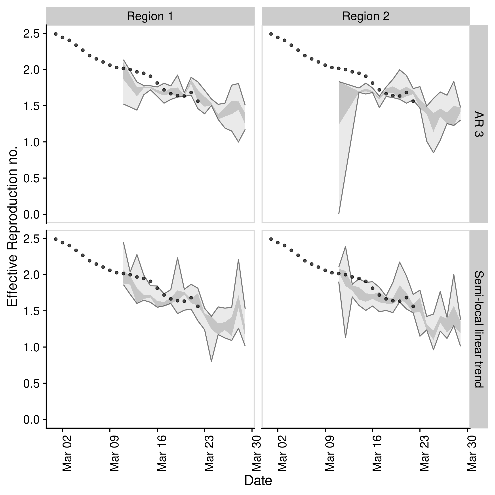

# EpiSoon

[](https://travis-ci.com/epiforecasts/EpiSoon)

*Warning: This package is a work in progress and is currently developed
solely with the COVID-19 outbreak in mind. Breaking changes may occur
and the authors cannot guarantee support.*

**Aim:** To forecast the time-varying reproduction number and using this
to forecast reported case counts.

## Installation

Install the analysis and all dependencies with:

``` r
remotes::install_github("epiforecasts/EpiSoon", dependencies = TRUE)
```

## Quick start

  - Load packages (`bsts` for models, `ggplot2` for plotting, and
    `cowplot` for theming)

<!-- end list -->

``` r
library(EpiSoon)
library(bsts)
library(future)
library(cowplot)
library(dplyr)
```

  - Set up example data (using `EpiSoon::example_obs_rts` and
    `EpiSoon::example_obs_cases` as starting data sets). When generating
    timeseries with `EpiNow` use `get_timeseries` to extract the
    required data.

<!-- end list -->

``` r
obs_rts <- EpiSoon::example_obs_rts %>%
   dplyr::mutate(timeseries = "Region 1") %>%
   dplyr::bind_rows(EpiSoon::example_obs_rts %>%
  dplyr::mutate(timeseries = "Region 2"))

obs_cases <- EpiSoon::example_obs_cases %>%
   dplyr::mutate(timeseries = "Region 1") %>%
   dplyr::bind_rows(EpiSoon::example_obs_cases %>%
   dplyr::mutate(timeseries = "Region 2"))
```

  - Define the list of models to be compared.

<!-- end list -->

``` r
models <- list("AR 3" =
                    function(...) {EpiSoon::bsts_model(model =
                     function(ss, y){bsts::AddAr(ss, y = y, lags = 3)}, ...)},
                "Semi-local linear trend" =
                function(...) {EpiSoon::bsts_model(model =
                    function(ss, y){bsts::AddSemilocalLinearTrend(ss, y = y)}, ...)})
```

  - Compare models across timeseries (change the `future::plan` to do
    this in parallel).

<!-- end list -->

``` r
future::plan("sequential")

## Compare models
forecasts <- compare_timeseries(obs_rts, obs_cases, models,
                                   horizon = 7, samples = 10,
                                   serial_interval = EpiSoon::example_serial_interval)

forecasts
#> $forecast_rts
#> # A tibble: 504 x 12
#>    timeseries model forecast_date date       horizon median  mean     sd bottom
#>    <chr>      <chr> <chr>         <date>       <int>  <dbl> <dbl>  <dbl>  <dbl>
#>  1 Region 1   AR 3  2020-03-05    2020-03-06       1   2.16  2.16 0.0119   2.14
#>  2 Region 1   AR 3  2020-03-05    2020-03-07       2   2.07  2.07 0.0269   2.03
#>  3 Region 1   AR 3  2020-03-05    2020-03-08       3   2.00  2.00 0.0157   1.98
#>  4 Region 1   AR 3  2020-03-05    2020-03-09       4   1.91  1.91 0.0225   1.87
#>  5 Region 1   AR 3  2020-03-05    2020-03-10       5   1.85  1.85 0.0228   1.81
#>  6 Region 1   AR 3  2020-03-05    2020-03-11       6   1.76  1.76 0.0168   1.74
#>  7 Region 1   AR 3  2020-03-05    2020-03-12       7   1.70  1.69 0.0419   1.60
#>  8 Region 1   AR 3  2020-03-06    2020-03-07       1   2.13  2.13 0.0163   2.08
#>  9 Region 1   AR 3  2020-03-06    2020-03-08       2   2.06  2.06 0.0149   2.04
#> 10 Region 1   AR 3  2020-03-06    2020-03-09       3   2.01  2.01 0.0116   1.99
#> # … with 494 more rows, and 3 more variables: lower <dbl>, upper <dbl>,
#> #   top <dbl>
#> 
#> $rt_scores
#> # A tibble: 392 x 10
#>    timeseries model forecast_date date       horizon    dss   crps    logs  bias
#>    <chr>      <chr> <chr>         <date>       <int>  <dbl>  <dbl>   <dbl> <dbl>
#>  1 Region 1   AR 3  2020-03-05    2020-03-06       1  -2.26 0.0231  -1.42      0
#>  2 Region 1   AR 3  2020-03-05    2020-03-07       2   1.40 0.0611   0.487     0
#>  3 Region 1   AR 3  2020-03-05    2020-03-08       3  40.9  0.0960  43.9       0
#>  4 Region 1   AR 3  2020-03-05    2020-03-09       4  40.0  0.136   76.4       0
#>  5 Region 1   AR 3  2020-03-05    2020-03-10       5  59.5  0.165   42.8       0
#>  6 Region 1   AR 3  2020-03-05    2020-03-11       6 239.   0.242  193.        0
#>  7 Region 1   AR 3  2020-03-05    2020-03-12       7  52.1  0.284  250.        0
#>  8 Region 1   AR 3  2020-03-06    2020-03-07       1  -6.53 0.0135  -2.29      0
#>  9 Region 1   AR 3  2020-03-06    2020-03-08       2   1.53 0.0370   7.87      0
#> 10 Region 1   AR 3  2020-03-06    2020-03-09       3  14.2  0.0469   9.39      0
#> # … with 382 more rows, and 1 more variable: sharpness <dbl>
#> 
#> $forecast_cases
#> # A tibble: 392 x 12
#>    timeseries model forecast_date date       horizon median  mean    sd bottom
#>    <chr>      <chr> <chr>         <date>       <int>  <dbl> <dbl> <dbl>  <dbl>
#>  1 Region 1   AR 3  2020-03-05    2020-03-06       1   71    71    8.30     61
#>  2 Region 1   AR 3  2020-03-05    2020-03-07       2   75.5  75    7.76     63
#>  3 Region 1   AR 3  2020-03-05    2020-03-08       3   87    86.1  8.31     74
#>  4 Region 1   AR 3  2020-03-05    2020-03-09       4   94    95.8  5.92     89
#>  5 Region 1   AR 3  2020-03-05    2020-03-10       5  106   109.  15.4      88
#>  6 Region 1   AR 3  2020-03-05    2020-03-11       6  111   114.   9.26    107
#>  7 Region 1   AR 3  2020-03-05    2020-03-12       7  118.  122.  15.5     101
#>  8 Region 1   AR 3  2020-03-06    2020-03-07       1   83.5  82.8  6.99     68
#>  9 Region 1   AR 3  2020-03-06    2020-03-08       2   91    91   10.5      76
#> 10 Region 1   AR 3  2020-03-06    2020-03-09       3  105   104.   8.56     86
#> # … with 382 more rows, and 3 more variables: lower <dbl>, upper <dbl>,
#> #   top <dbl>
#> 
#> $case_scores
#> # A tibble: 392 x 11
#>    timeseries model sample forecast_date date       horizon   dss  crps  logs
#>    <chr>      <chr> <chr>  <chr>         <date>       <int> <dbl> <dbl> <dbl>
#>  1 Region 1   AR 3  1      2020-03-05    2020-03-06       1  4.19  3     3.42
#>  2 Region 1   AR 3  1      2020-03-05    2020-03-07       2  7.11  8.78  3.98
#>  3 Region 1   AR 3  1      2020-03-05    2020-03-08       3  8.20 11.8   4.63
#>  4 Region 1   AR 3  1      2020-03-05    2020-03-09       4 16.4  17.1   7.96
#>  5 Region 1   AR 3  1      2020-03-05    2020-03-10       5 10.4  26.7   5.59
#>  6 Region 1   AR 3  1      2020-03-05    2020-03-11       6 40.0  48.1  26.1 
#>  7 Region 1   AR 3  1      2020-03-05    2020-03-12       7 29.2  64.0  14.4 
#>  8 Region 1   AR 3  1      2020-03-06    2020-03-07       1  4.40  2.62  2.89
#>  9 Region 1   AR 3  1      2020-03-06    2020-03-08       2  5.82  7.52  4.16
#> 10 Region 1   AR 3  1      2020-03-06    2020-03-09       3  6.30  7.48  3.69
#> # … with 382 more rows, and 2 more variables: bias <dbl>, sharpness <dbl>
```

  - Plot an evaluation of Rt forecasts using iterative fitting.

<!-- end list -->

``` r
plot_forecast_evaluation(forecasts$forecast_rts, obs_rts, c(7)) +
   ggplot2::facet_grid(model ~ timeseries) +
   cowplot::panel_border()
```


  - Plot an evaluation of case forecasts using iterative fitting

<!-- end list -->

``` r
plot_forecast_evaluation(forecasts$forecast_cases, obs_cases, c(7)) +
   ggplot2::facet_grid(model ~ timeseries, scales = "free") +
   cowplot::panel_border()
```



  - Summarise the forecasts by model scored against observed cases

<!-- end list -->

``` r
summarise_scores(forecasts$case_scores)
#> # A tibble: 10 x 9
#>    score     model                bottom lower median   mean  upper   top     sd
#>    <chr>     <chr>                 <dbl> <dbl>  <dbl>  <dbl>  <dbl> <dbl>  <dbl>
#>  1 bias      AR 3                   0     0     0.100  0.298  0.575   1    0.379
#>  2 bias      Semi-local linear t…   0     0     0.100  0.287  0.5     1    0.353
#>  3 crps      AR 3                   4.02 11.2  23.1   37.1   46.7   166.  40.9  
#>  4 crps      Semi-local linear t…   3.90  9.38 20.2   33.1   37.0   157.  39.6  
#>  5 dss       AR 3                   5.00  7.05  9.54  15.0   16.0    62.7 15.0  
#>  6 dss       Semi-local linear t…   4.96  6.69  8.59  12.8   12.0    64.0 13.7  
#>  7 logs      AR 3                   3.48  4.45  5.33  10.2    8.17   62.1 13.7  
#>  8 logs      Semi-local linear t…   3.45  4.29  5.10   8.78   6.94   39.3 15.6  
#>  9 sharpness AR 3                   5.19 10.6  17.0   18.7   22.2    48.1 10.7  
#> 10 sharpness Semi-local linear t…   5.93 11.1  17.0   20.6   24.8    55.1 13.5
```

## Docker

This package was developed in a docker container based on the
`rocker/geospatial` docker image.

To build the docker image run (from the `EpiSoon` directory):

``` bash
docker build . -t episoon
```

To run the docker image
run:

``` bash
docker run -d -p 8787:8787 --name episoon -e USER=episoon -e PASSWORD=episoon episoon
```

The rstudio client can be found on port :8787 at your local machines ip.
The default username:password is epinow:epinow, set the user with -e
USER=username, and the password with - e PASSWORD=newpasswordhere. The
default is to save the analysis files into the user directory.

To mount a folder (from your current working directory - here assumed to
be `tmp`) in the docker container to your local system use the following
in the above docker run command (as given mounts the whole `episoon`
directory to `tmp`).

``` bash
--mount type=bind,source=$(pwd)/tmp,target=/home/EpiSoon
```

To access the command line run the following:

``` bash
docker exec -ti episoon bash
```
